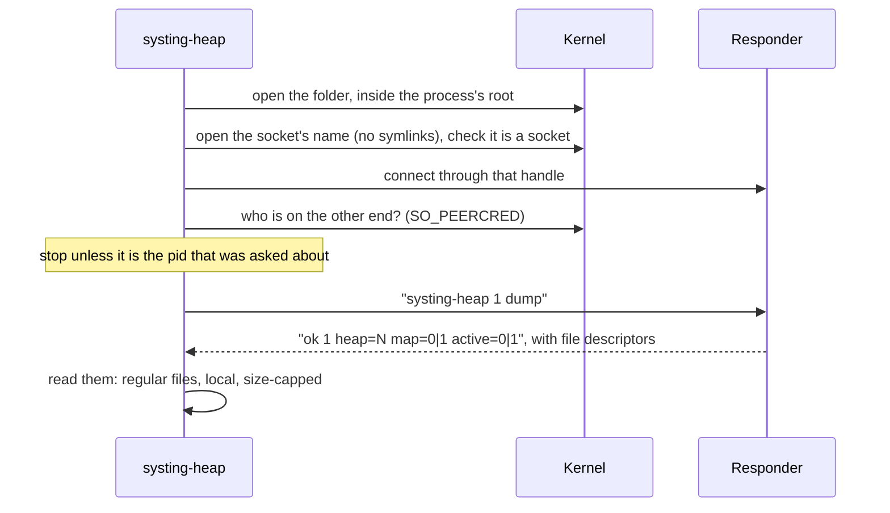
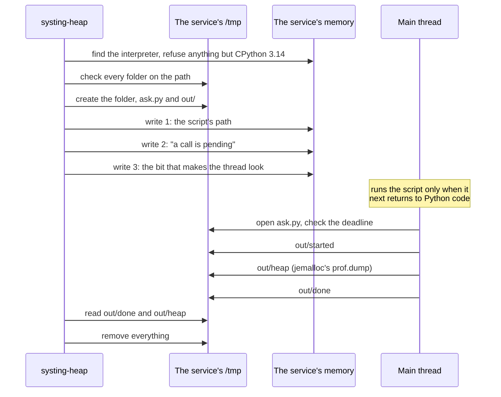
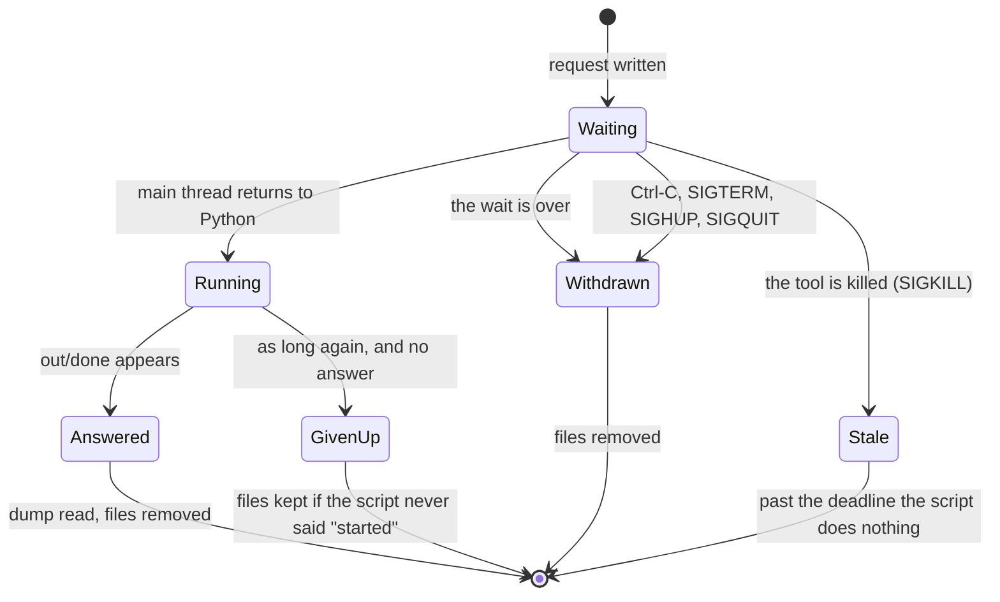

# systing-heap internals

How each way of collecting a heap dump works inside, which safety rules it follows, and what has and has not been tested.

This page is for reviewers, maintainers, and anyone deciding whether a mode is safe for their service.
**To set a service up, read the guide instead: [`HEAP_SNAPSHOTS.md`](HEAP_SNAPSHOTS.md).**

| Section | What is in it |
|---|---|
| [Threat model](#threat-model) | What is trusted and what is not |
| [What each way does to a service](#what-each-way-does-to-a-service) | Side by side |
| [Permissions](#permissions) | Who may run what |
| [Resolving paths inside a container](#resolving-paths-inside-a-container) | `--pid` and `--root-fd` |
| [The socket](#the-socket---ask) | `--ask` |
| [The Python way](#the-python-way---ask-python) | `--ask python` |
| [Reading memory](#reading-memory---snoop) | `--snoop` |
| [The check](#the-check---check) | `--check` |
| [What has been tested](#what-has-been-tested) | And what has not |

## Threat model

`systing-heap` may run as **root on a host**, looking at a process inside a container.

| | Trusted? |
|---|---|
| The person running the tool | Yes |
| The process being looked at | **No.** It may be hostile. |
| Other processes of the same user as that process | **No** |
| Files in that process's container | **No** |
| Text the process chose: file names, error messages, its name, its environment | **No** |

What follows from that, and where each rule holds:

| Rule | How | Holds for |
|---|---|---|
| A path the process chose cannot lead outside its container | The kernel resolves it inside the container's root (`openat2` with `RESOLVE_IN_ROOT`) | Everything with `--pid` or `--root-fd` |
| Reads cannot be made endless | Size caps on what is read | Everything |
| The run cannot be made endless | An overall time limit | `--ask`, `--snoop`, `--check`. **Loading snapshot files has none.** |
| A stalling filesystem cannot hang the tool | Files on FUSE and network filesystems are left unread | With a root: binaries, Python maps, what the socket hands over, the `--ask python` folders, the `--check` listing. **The snapshot files themselves are read wherever they are.** |
| Printed text cannot drive the terminal | Control and invisible characters are escaped, or the value is not used | `--ask`, `--snoop`, `--check`. **Loading snapshot files prints the paths a dump names as they are.** |
| The pid cannot change meaning midway | `/proc/PID` is opened once, and memory, maps and root are all opened through that handle | `--ask`, `--snoop`, `--check` |
| Nothing is removed by following what the process put there | Files are removed by known names, without recursion, through open folder handles | Everything that removes files |

## What each way does to a service

| | Socket (`--ask`) | Snapshot files | `--ask python` | `--snoop` |
|---|---|---|---|---|
| Code of ours in the service | The responder library | None | None | None |
| Threads added | One | None | None | None |
| Writes to the service's memory | No | No | **Yes**: up to 517 bytes | No |
| Runs code in the service | jemalloc's `prof.dump`, on our thread | No | **Yes**: a script, on the main thread | No |
| Stops or signals the service | No | No | No | No |
| Uses `ptrace` | No | No | No | No |
| Files created | The socket | The dumps | A script and a dump, removed afterwards | None |
| The dump is taken under jemalloc's locks | Yes | Yes | Yes | **No** |

## Permissions

| Action | Needed by | The kernel allows it to |
|---|---|---|
| Open `/proc/PID/root` | Everything with `--pid` | The same user, or `CAP_SYS_PTRACE` |
| Connect to the socket | `--ask` | The socket file is `0600`. The responder also checks the caller: the service's user, or root. |
| Read `/proc/PID/mem` | `--snoop`, `--check`, `--ask python` | See below |
| Write `/proc/PID/mem` | `--ask python` | The same as reading |

**Reading another process's memory** needs no capability when all three of these hold:

1. The tool runs as the same user as the process.
2. The process is dumpable. It is, unless it is setuid, changed its user, or called `prctl(PR_SET_DUMPABLE, 0)`.
3. `kernel.yama.ptrace_scope` permits it:

| `ptrace_scope` | Who may read |
|---|---|
| 0 | Any process of the same user |
| 1 (the default on many distributions) | Only the process's ancestors, unless it opts in with `prctl(PR_SET_PTRACER, …)` |
| 2 | Only with `CAP_SYS_PTRACE` |
| 3 | Nobody |

Any other user, root included, needs `CAP_SYS_PTRACE`.

## Resolving paths inside a container

With `--pid` or `--root-fd`, every path the tool did not choose itself is looked up inside that root.

| Case | What happens |
|---|---|
| An absolute symlink inside the container | Resolved inside the container. Joining paths by hand would follow it into the host's files. |
| `..` at the top of a path | Stays inside |
| A path a dump was crafted to name | Stays inside |
| Links in `/proc` that jump elsewhere (`/proc/<pid>/exe`, `/proc/<pid>/fd/N`) | Refused |
| Mounts inside the root, such as the volume with the dumps | Crossed |
| A kernel older than 5.6 | The run fails. There is no fallback to plain opens. |

**Why debug info is not read inside a root.** The symbolizer looks up a binary's separate debug file (its debug link, its `.dwp`) by paths it builds itself. Those paths would be the reader's, not the container's, and the name is the binary's to choose. So names come from the binaries' own symbol tables: no inlined frames, no file and line.

**Why FUSE and network filesystems are skipped.** Whoever wrote the dumps chose those paths. A read there would be made with the reader's authority, on storage the container only mounts, and it can stall forever.

**Why map ownership is stricter.** The reader is outside the container and is not the user its processes run as. A map in a world-writable folder is used only if root owns it, or the user who owns that process's dump, since the same process wrote both. No other user in the container can then name that process's frames.

**A pid can be reused** between a caller's look at it and the tool's open. A person at a shell need not care. A program that has checked which process a number names should pass the folder it checked, with `--root-fd`.

## The socket (`--ask`)

Experimental. The service's side is described in [`heap/hooks/README.md`](../heap/hooks/README.md). This is the tool's side.

| Concern | What is done |
|---|---|
| The name is swapped for a link that leads out of the container | The name is opened with `O_PATH \| O_NOFOLLOW`, checked, and connected to through that handle. What is connected to is what was checked. |
| Another process answers at that name | The peer's pid is compared with the pid asked about **before** anything is sent |
| The answer is huge, or is not a file | Each descriptor must be a regular file, not on FUSE or a network filesystem, and within the size cap |
| The answer carries too many descriptors | Two at most. Truncated control data is an error. |
| The service never answers | `--ask-wait`, and an overall limit of three times that plus 10 seconds |
| The error text is hostile | It is printed with control characters escaped |
| The code map belongs to another process | Its token must match the one recorded in the dump |

**Finding the socket.** Without `--ask-dir`, the tool reads `SYSTING_HEAP_HOOKS_SOCKET_DIR` from `/proc/PID/environ`, then tries the process's `/tmp`. Both are tried because a folder given in a `listen()` call wins over the variable. Only "no socket here", which includes a folder that does not exist or is not a folder, moves on to the next one. Any other failure stops the search, because it concerns a socket that exists.

**The variable's value is hostile input.** It goes into every message about the socket, and into the snapshot's `source_path`. A value that is relative, has control or invisible characters, is not valid text, or is longer than 4,096 bytes is ignored, and the tool goes straight to `/tmp`. An earlier version printed it unescaped.

## The Python way (`--ask python`)

Experimental. CPython 3.14 lets a debugger ask an interpreter to run a script file (PEP 768; `sys.remote_exec` is Python's own way to ask). The tool asks the same way, from outside.

### What is written to memory

| Write | Size | Notes |
|---|---|---|
| The script's path | Up to 512 bytes | |
| The pending flag | 4 bytes | |
| The lowest byte of `eval_breaker` | 1 byte | Only the byte that holds the bit. CPython's own writer rewrites the whole word. |

- **Only one thread's state is written to:** the one the interpreter names as running `__main__`. In a Python started as a program that is the main thread's, which lives as long as the interpreter. Another thread's state is freed when the thread ends.
- **It is checked again before each write** that the interpreter still names that state, including the write that undoes the second if the third fails.
- **One known loss.** A bit the process sets in that byte between the tool's read and its write is lost, as it is with CPython's own writer. A request to give up the GIL is made again. A signal handler or a queued call waits for the next thing that makes the thread look.

### What is refused, with nothing written

| Refused | How it is known |
|---|---|
| A process that maps no Python | Its memory map, read before its memory is opened for writing |
| A Python other than 3.14, or a pre-release | The interpreter's own table of offsets says which it is |
| A free-threaded build | The same table. Not tried. |
| Remote debugging turned off (`PYTHON_DISABLE_REMOTE_DEBUG`, `-X disable-remote-debug`) | The interpreter's own flag. A service owner's opt-out is honoured. |
| No main thread, as in some embedded interpreters | The interpreter names none |
| Another request is already waiting | The pending flag is set |
| An unsafe folder | See below |

### The files

The service opens the script **by path**, and possibly long after it was asked. So the path must keep naming what the tool wrote.

| | Owner | Mode | Why |
|---|---|---|---|
| `.systing-heap-ask.<random>/` | The tool's user | `0755` | The service enters and reads. It cannot add, remove or rename. |
| `ask.py` | The tool's user | `0444` | The service reads it and cannot change it |
| `out/` | The service's user | `0700` | The only place the service writes |

An earlier version gave the script to the service's user. Any process of that user could then replace it, and the service would run the replacement. Where `ptrace_scope` is 1 or more, that got around the setting.

**Every folder from the process's root down to `--ask-dir` is checked**, whoever asks. The request is refused if any of them:

| Is | Because |
|---|---|
| Owned by anyone but root or the tool's user | Its owner can rename what is in it |
| Owned by the service's user, when that is not the tool's user | The same |
| Writable by group or others, without the sticky bit | Anyone who can write there can rename the tool's folder away and put another in its place |
| Reached through a symlink | The link could be changed |
| On a FUSE or network filesystem | Ownership and content are whatever a program says they are |

`/tmp` passes when it is owned by root with the sticky bit.

**Where no folder will do**

| Case | Way out |
|---|---|
| The only writable folders are Kubernetes `emptyDir` volumes (`0777`, or `2775` with an `fsGroup`) | `chmod +t` on one, from the host or the container |
| The process is in a user namespace, so its root folder belongs to the namespace's root and not the host's | None. Use `--snoop`, or the socket asked from inside the container as the service's own user: the responder would see the host's root as another user and refuse it. |

**When the tool and the service are the same user**, every other user is still kept out, but nothing keeps a user from its own files. The tool prints a warning. This includes a service running as root in a container without a user namespace, asked by root on the host: the two roots are one user.

**Reading back what the service wrote.** `out/` belongs to the service's user, who can put anything there.

| Planted at `out/done` or `out/heap` | Result |
|---|---|
| A symlink | Refused. The name is opened with `O_PATH \| O_NOFOLLOW` and examined before it is opened for reading. |
| A device or FIFO | Refused before it is opened for reading, since opening a device already does something to it |
| A hard link to a file only the tool could read | Refused: the file must belong to the service's user and have one name |
| A symlink at `heap`, to make the service overwrite something | Not followed. The script creates the file itself (`O_EXCL \| O_NOFOLLOW`) and gives jemalloc `/proc/self/fd/N`. |

### What the script does

1. Checks the time. Past its deadline, it returns without doing anything.
2. Creates `out/started`, so the tool knows the request was taken up however long the dump takes.
3. Imports `ctypes`, which the process keeps imported, and finds `mallctl`.
4. Has jemalloc write the dump, and asks whether sampling is paused.
5. Writes `out/done` with the outcome.

- **The main thread does nothing else meanwhile.** In an event-loop service that is the thread that serves every request.
- **Other Python threads keep running.** The call into jemalloc releases the GIL, as every `ctypes.CDLL` call does.
- **Errors are written for the tool to report.** Anything that still escapes is printed by the interpreter as an unraisable exception, and the service carries on.
- **Audit hooks see it** as `cpython.remote_debugger_script`. A hook that refuses stops the request.

### When it runs, and when it does not

The interpreter looks for a pending request between bytecodes and where it checks for signals.

| Main thread is | Result |
|---|---|
| Running Python code, or an event loop | Answers quickly: 24 to 44 ms, measured on one machine |
| Busy in C for a while | Answers when it returns: 0.7 s in one measurement |
| In `time.sleep()`, `Thread.join()`, or a blocking read | Does not answer until that call returns. Nothing wakes it. |

### When the tool is ended early

| Event | What happens |
|---|---|
| `SIGINT`, `SIGTERM`, `SIGHUP`, `SIGQUIT` | The request is withdrawn and the files are removed. The tool then ends **by that signal**, so its caller sees that it was interrupted. |
| A second signal of the same kind | Ends the tool at once |
| A signal while the tool is itself stuck, on a stalling filesystem or page | The tool ends after 2 seconds |
| `SIGKILL` | Nothing can be undone. The request stays pending and the files stay. |

**After `SIGKILL`** the script still belongs to the tool's user, and it carries a deadline: the wait plus 5 seconds. When the main thread reaches the request after that, the script does nothing, and the service can be asked again.

> **Do not remove a leftover folder while its request may still be pending.**
> What makes a late request harmless is inside the script. With the folder gone, its name, which anyone could read in `/tmp`, is free for anyone who can write there, and the service would run what they put in it.
> Remove it once the service has ended or its main thread has returned to Python. Until then a new request is refused with "another request is waiting".

**The tool follows the same rule.** It removes nothing, and says why, when it cannot be sure that no thread will still come for the script: the request could not be withdrawn from a living process, or it was taken up and the script never reported `started`.

## Reading memory (`--snoop`)

Experimental. It reads the profile jemalloc holds, from `/proc/PID/mem`, with no help from the process.

### What is read

| File | For |
|---|---|
| `/proc/PID/mem` | The profile. The kernel answers an address that is gone with an error, so a read cannot fault or crash the process. |
| `/proc/PID/maps` | Naming frames |
| `/proc/PID/status` | The pid the process knows itself by |
| `/proc/PID/environ` | The sampling period in `MALLOC_CONF`, and only when the library has no symbol for it. Nothing else from it is used or stored. |

### Finding the profile

The table that holds every backtrace, `bt2gctx`, is a `static` in jemalloc. It has no exported name.

| Build | How it is found |
|---|---|
| Keeps its `.symtab` | By name |
| Stripped, such as Debian's and Ubuntu's `libjemalloc2` | By shape: the only static in the library that is a hash table of jemalloc's own backtrace records, each of which points back at itself |

Either way, what is found is checked against that shape before it is used.
If a symbol does not lead to such a table, which happens when a library is replaced on disk under a running process, the memory is searched by shape instead.

### Not a still picture

jemalloc's locks are not taken, so the profile changes while it is read.

| What can happen | What the tool does |
|---|---|
| A stack's counts come from slightly different moments | Nothing. This is inherent. |
| Memory was freed and reused | The record fails jemalloc's invariants and is skipped |
| The table was swapped for another | It is read again |
| jemalloc is rebuilding the table | The entries found are compared with the table's own count. A read that keeps disagreeing is used anyway and marked `unsteady`. |
| An entry was being moved between cells, or a subtree was hidden during a rotation | **Not detected.** A record missed this way raises no skip. |
| A tree has more than 65,536 records | Cut there, and counted as a skipped record |

How each read went is printed, and stored in `heap_live_read`. A Perfetto trace has no place for it.

### What is refused

There is no version check. A version string is a label, and a fork with another label would be refused for no reason. The data itself is checked.

| Check | What it pins down |
|---|---|
| A record's key is the address of its own backtrace | It is a backtrace record |
| A thread record points back at its backtrace, its state is one of four values, its links are aligned | It is a thread record |
| Thread records are in the order jemalloc keeps them | The link offsets and the key offsets agree |
| Each sampled object adds at least 8 to the shifted count, and at least its size to the unbiased bytes | The order of the counters |
| Most records can be read at all | The layout as a whole |

The last three are judged over a whole walk and refuse the run only for a large share, since a moving heap breaks each of them for a few records.
The summary line prints how much each check had to go on, and says so when it had fewer than eight records.

**A gap.** A jemalloc that differs in a way none of these sees, such as a fork that moves the counters but keeps those relations, would be read wrongly and not refused. Only the comparison with real dumps, on the builds listed under [What has been tested](#what-has-been-tested), covers that.

### The numbers

| Columns | What they are |
|---|---|
| `live_*`, `alloc_*` | jemalloc's raw sampled counts, as a dump written with `prof_unbias:false` prints them. The tests compare them one by one with such a dump of the same process. |
| `est_*` | The estimate jemalloc keeps for each stack, summed object by object as they were sampled. A dump cannot carry that, so these differ from a dump's by rounding: the tests check the total to 0.5%. |

The estimates do not depend on the sampling period, so a period the tool could not learn cannot spoil them.

### Limits

| Topic | Detail |
|---|---|
| Sample period | From the library's symbols. Failing that, from the `MALLOC_CONF` the process started with. Failing that, jemalloc's default. The summary says which. A wrong value changes only the label. |
| `prof.reset` | After a reset to another period, jemalloc's unbiased counters can be off or wrap. A stack whose counter wrapped gets the estimate its raw counts give. A large share of those refuses the run. Counters of threads that a reset marked expired may be counted. Not tested. |
| Paused sampling | Not checked |
| Python frames | Need `--perf-map-dir`. There is no dump to look beside. |
| A young or idle heap | Nothing has been sampled, and the tool says so |
| Time | Given up on after 3 minutes |
| **One case not closed** | A page behind a FUSE server that takes the read and never answers keeps a thread in the kernel. After the deadline's error, the tool may still not exit until the server does. |

**Everything is capped**, over the whole run and not per file: ELF header sizes and symbol table counts, the size of the profile table, the per-thread records and stack frames held, how much of a library's data is scanned, how many files are looked in, and the size of each `/proc` file read.
A hostile process can make a run fail, refuse, or take up to the time limit. It cannot make the tool read or allocate without limit.

The code is in `heap/src/snoop/`. Nothing else in the crate knows how it works.

## The check (`--check`)

Experimental. It reports what a process has, and which commands will work.

**It is read-only.** Nothing is written to the process, and nothing is asked of it.

| It looks at | How |
|---|---|
| jemalloc, the hooks library, Python stacks | The process's memory map |
| jemalloc's settings | `MALLOC_CONF`, in the environment the process was started with |
| Snapshot files | It lists the `prof_prefix` folder, inside the process's root |
| The socket | It connects, checks who answers, and disconnects without sending anything. The responder goes back to sleep. This step has its own limit of 10 seconds, so a stopped or hung process does not cost the rest of the report. |
| `--ask python` | It runs the same refusals and folder checks, on `--ask-dir` or `/tmp`, with the memory opened read-only. It also asks the kernel whether that folder is on a read-only filesystem. |
| `--snoop` | It runs a whole snoop, limited to 30 seconds, and discards the result |

| Concern | What is done |
|---|---|
| **The printed commands contain paths the process chose**, and someone, perhaps root, will paste them into a shell | Each path is printed as one shell word, in single quotes where needed. A path with a control character, or one that is not valid text, is never printed in a command: the entry is listed with a note in place of its command. |
| The process slows any step | The whole check is given up on after 90 seconds |
| The tool may not read the process's memory | "Could not look" is kept apart from "looked and did not find". The report says profiling is unconfirmed or unknown, and advises running as root, not changing the service. |
| `--ask python` writes to memory, so it should not be recommended lightly | It is listed only if profiling was actually **seen**: the profile was read from memory, or the socket answers. `prof:true` in the environment is not enough, since a process can have the variable without jemalloc. |

**What it cannot see**

- Settings compiled into the program or in `/etc/malloc.conf`.
- Dumps the service writes by calling jemalloc itself.
- A socket whose folder was given in a `listen()` call. Pass `--ask-dir`.
- Whether a Python's main thread will actually return to Python code.
- A profile that takes between 30 seconds and 3 minutes to read. It is reported as unreadable, although `--snoop` itself would wait.

## What has been tested

Everything below ran on **x86-64 Linux with glibc**.

| | Tested with |
|---|---|
| Snapshot files | Ubuntu's `libjemalloc2` 5.3.0 |
| The socket | CPython 3.12, 3.13 and 3.14 with `libjemalloc2` 5.3.0; CPython 3.14.7 with jemalloc 5.3.1; a native C program; the responder-only library; the environment switch, with `1` and `fork`; asked by the same user and by root; **asked by root from outside a service that has its own pid and mount namespaces**, where it is pid 1 and its socket is in a `/run` the host cannot see |
| `--ask python` | CPython 3.14.6 with `libjemalloc2` 5.3.0 (CI); CPython 3.14.7 with jemalloc 5.3.1; **as root against a service of another user**, with that user trying to write, remove, replace and rename the script and its folders |
| `--snoop` | `libjemalloc2` 5.3.0 (stripped), jemalloc 5.3.0 built from source, and the `dev` branch, with `prof_accum` and `prof_unbias` each on and off |
| `--check` | Every command it prints is run through a shell, against a service that has everything and whose socket folder is named with a space, `;` and `$` |
| `backtrace="python"` | CPython 3.12, 3.13 and 3.14 |

**In CI:** the tests run on every pull request, on GitHub's Ubuntu runners, whose default for `kernel.yama.ptrace_scope` is 1. A missing dependency, Python 3.14 and `sudo` included, fails the run and is not skipped.

| Not tested | Note |
|---|---|
| aarch64 | jemalloc lays its structures out the same on paper. CI's arm64 job does not run these tests. |
| Free-threaded Python | Refused by `--ask python` and by `backtrace="python"` |
| C libraries other than glibc | `SYSTING_HEAP_HOOKS_LISTEN=fork` in particular relies on glibc's order of events |
| User namespaces | The responder would see the host's root as another user and refuse it. `--ask python` refuses every folder. |
| jemalloc 4, and 5.0 to 5.2 | |
| A jemalloc linked statically into the program | `--snoop` looks in the program itself too, after the libraries. The hooks library finds it only if the program exports `mallctl`. Both untried. |
| A real container runtime or Kubernetes cluster | The namespaces test above uses `unshare`, not a runtime |
| `sitecustomize.py` | Run by hand on CPython 3.12 and 3.13. No automated test. |
| A genuinely hostile process | The limits and refusals are covered by unit tests and code review, not by an adversary |
