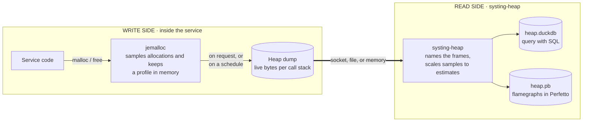
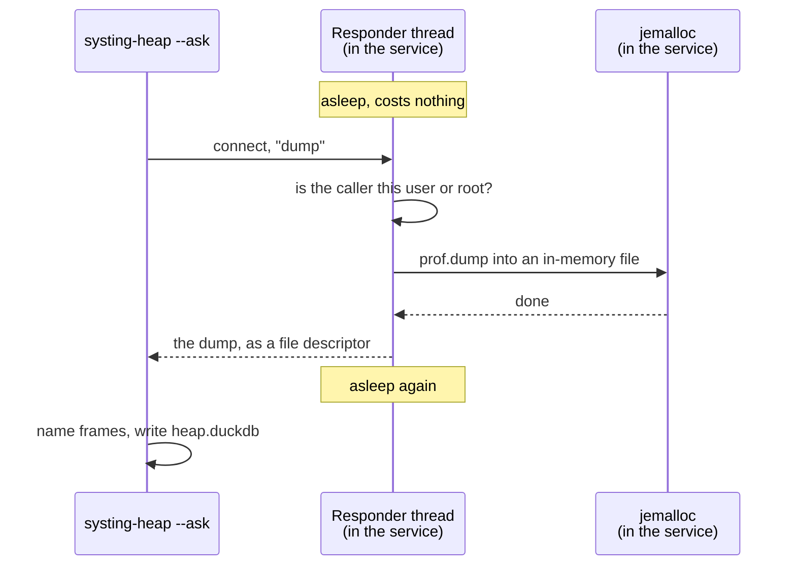
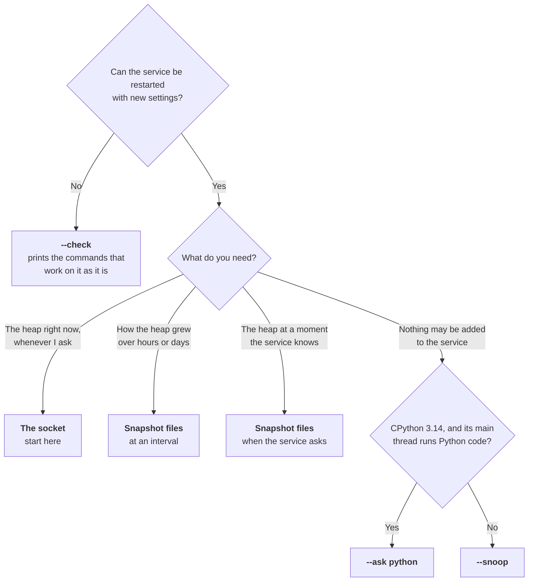

# Heap profiling with systing-heap

Find out **which code holds a service's memory**, by call stack, while the service runs.

> **Heap profiling in systing is still experimental.**
> Flags, environment variables, function names, the socket's protocol and the database tables may change between releases. Pin a version if you build automation on it.

```text
est. live      call stack
 14.5 MiB      main → serve → leak_buffers → malloc
  1.2 MiB      main → serve → load_config → parse → malloc
```

This guide takes a service from nothing to that answer.
Read "How it works" and "Prerequisites", then follow "Start here". The rest is for when the default does not fit.

| Section | Read it when |
|---|---|
| [How it works](#how-it-works) | First. Five minutes. |
| [Prerequisites](#prerequisites) | Before you change anything. |
| [Start here: collect over the socket](#start-here-collect-over-the-socket) | You want the recommended setup. |
| [Other ways to collect](#other-ways-to-collect) | The socket does not fit, or you cannot change the service. |
| [Advanced](#advanced) | Tuning, forked workers, containers, C API. |
| [Costs](#costs), [Limits](#limits), [Troubleshooting](#troubleshooting) | Before production, and when something is off. |

## How it works

There are two sides. They are set up by different people at different times.



| | Write side | Read side |
|---|---|---|
| What it is | jemalloc, with heap profiling on, inside the service | The `systing-heap` command |
| Who sets it up | The service's owner | Whoever is investigating |
| When | Once, at deploy time. **It takes a restart.** | Every time someone wants to look |
| What it produces | A heap dump | A DuckDB database or a Perfetto trace |

**A few words used throughout**

| Word | Meaning |
|---|---|
| Sample | jemalloc does not record every allocation. It records some of them, each with the call stack that made it. How many is set by `lg_prof_sample`: on average one per 2^`lg_prof_sample` bytes allocated. jemalloc's default is 19, which is one per 512 KiB. See [Sampling](#sampling-detail-against-overhead). |
| Profile | What jemalloc keeps in memory: for each call stack, the sampled memory that is still allocated. |
| Dump, snapshot | The profile written out at one moment. The two words mean the same thing here. |
| Estimate | `systing-heap` scales the samples back up to the size of the real heap. These are the `est_*` columns. |
| Hooks library | The small library from `heap/hooks/` that a service can load. It has two parts: the responder, and Python frames. |
| Responder | The part of the hooks library that answers on the socket: one thread inside the service. |
| Code map | A small file, `pycode-<pid>-<token>.map`, that the hooks library writes. It names the Python functions in a process's stacks. |

### The write side is three separate choices

Keeping these apart makes everything else simpler. Each is chosen on its own.

| # | Choice | Question it answers | Options |
|---|---|---|---|
| 1 | **Heap profiling** | Is jemalloc sampling at all? | On. Required, and the same for every service. |
| 2 | **Stacks** | What does each sample record? | **Native frames**: always, nothing to do. **Python frames as well**: one call, Python services only. |
| 3 | **Collection** | How does the dump reach the tool? | **The socket** (recommended), snapshot files, or nothing added at all. |

## Prerequisites

| What | Requirement | Needed for |
|---|---|---|
| Operating system | Linux, glibc. x86-64 is what has been tested. | Everything |
| Kernel | 5.6 or newer | Anything that uses `--pid`, which includes the socket |
| Allocator | jemalloc **built with profiling**, version 5.3 or newer. Ubuntu 24.04's and Debian 12's `libjemalloc2` package is 5.3.0 with profiling. Older releases ship 5.2.1: too old for Python frames, and untested for the rest. | Everything |
| A restart | Profiling cannot be turned on in a running process | Everything |
| Python | CPython 3.12, 3.13 or 3.14, the regular build (not free-threaded) | Python frames in the stacks |
| A writable folder | One the service can write to. It holds the socket, and for Python the file that names Python functions. | The socket, Python frames |
| To build the library | A C compiler and `make`. Build it against a glibc no newer than the service image's. | Once |
| To build the tool | Everything systing itself needs: Rust 1.89 or newer, `clang`, `bpftool`, and the `libelf`, `libbpf` and kernel headers. On Ubuntu: `linux-tools-common libelf-dev linux-libc-dev clang libbpf-dev make pkg-config`. | Once |
| To run the tool | `libelf`, `zlib`, `libzstd` and `libstdc++` on the machine. A slim image may lack them. | The read side |
| Permission | Run `systing-heap` as **root on the host**, or as **the service's own user**. Root in another container usually will not do: it needs `CAP_SYS_PTRACE`, which containers do not get by default. | The read side |

Check that your jemalloc can profile. This should list one file:

```bash
LD_PRELOAD=/usr/lib/x86_64-linux-gnu/libjemalloc.so.2 \
MALLOC_CONF=prof:true,prof_final:true,prof_prefix:/tmp/jecheck /bin/true
ls /tmp/jecheck.*.heap && rm /tmp/jecheck.*.heap
```

Build both halves, from the root of this repository:

```bash
cargo build --release -p systing-heap    # the read side
make -C heap/hooks                       # the write side
```

| Built file | What it is | Where it goes |
|---|---|---|
| `target/release/systing-heap` | The tool | Wherever you investigate from |
| `heap/hooks/libsysting_heap_responder.so` | The socket alone. Small, and knows nothing about Python. | The image of a native service |
| `heap/hooks/libsysting_heap_hooks.so` | The socket and Python frames | The image of a Python service |
| `heap/hooks/systing_heap_hooks.py` | The Python helper | Next to `libsysting_heap_hooks.so` |

## Start here: collect over the socket

The service gets one small library. It starts one thread, which sleeps on a Unix socket until someone asks.
When you ask, that thread has jemalloc write a dump into memory and hands it over.



Why this is the default:

| Property | What it means |
|---|---|
| **On demand** | You get the heap as it is now, not as it was at the last interval. |
| **Complete** | It is jemalloc's own dump, taken under jemalloc's locks. |
| **Always answers** | It has its own thread, so it answers even when the service's threads are busy or blocked. |
| **No dumps on disk** | The dump is handed over in memory, so no snapshot files pile up. |
| **No code change** | Native services need environment variables only. |

### Step 1: turn on heap profiling

The same for every service, whatever the language.

```bash
LD_PRELOAD=/usr/lib/x86_64-linux-gnu/libjemalloc.so.2
MALLOC_CONF=prof:true
```

If the service already runs on jemalloc, keep it, and check that build has profiling (see [Prerequisites](#prerequisites)).

Both jemalloc and the library have to be in the service's image. For example:

```dockerfile
RUN apt-get update && apt-get install -y libjemalloc2
# native service
COPY libsysting_heap_responder.so /opt/systing/
# Python service
COPY libsysting_heap_hooks.so systing_heap_hooks.py /opt/systing/
```

### Step 2: add the socket

Pick your kind of service.

#### Native services

C, C++, Rust: anything that allocates through `malloc`. No code change.

```yaml
env:
  - name: LD_PRELOAD              # jemalloc first, then the responder
    value: /usr/lib/x86_64-linux-gnu/libjemalloc.so.2:/opt/systing/libsysting_heap_responder.so
  - name: MALLOC_CONF
    value: prof:true
  - name: SYSTING_HEAP_HOOKS_LISTEN
    value: "1"
  - name: SYSTING_HEAP_HOOKS_LISTEN_ONLY    # the file name of the service's executable
    value: my-service
  - name: SYSTING_HEAP_HOOKS_SOCKET_DIR     # a folder the service can write to
    value: /run/my-service
volumeMounts:
  - name: heap-socket                       # the folder must exist: the library does not create it
    mountPath: /run/my-service
# and in the pod's spec:
volumes:
  - name: heap-socket
    emptyDir: {}
```

| Variable | What it does | If you leave it out |
|---|---|---|
| `SYSTING_HEAP_HOOKS_LISTEN=1` | Starts the socket when the library loads | No socket. The library does nothing. |
| `SYSTING_HEAP_HOOKS_LISTEN_ONLY` | Only the program with this file name listens | **Every** program the service starts also gets a thread and a socket. That breaks some of them: see [Limits](#limits). |
| `SYSTING_HEAP_HOOKS_SOCKET_DIR` | Where the socket file goes | `/tmp`, where any user can take the name first and block the socket |

Stacks show the service's functions:

```text
_start → __libc_start_main → main → serve → leak_buffers → malloc
```

#### Python services

Two things differ from a native service:

- **`PYTHONMALLOC=malloc`.** Python serves small objects from its own pools, which jemalloc never sees. For 400,000 small dicts on CPython 3.13, jemalloc's own count of allocated bytes grew by 3.4 MB without this setting and by 118.5 MB with it.
- **Two calls at startup**, so the stacks show Python functions. Without them you get the interpreter's C functions (`_PyEval_EvalFrameDefault`) where your code ran.

**Rebuild a library taken from systing 1.26.0 or earlier.** Its backtraces could, rarely, corrupt the service's heap: [what happened, and who is exposed](../heap/hooks/README.md#a-backtrace-and-the-dynamic-loader).

```yaml
env:
  - name: LD_PRELOAD
    value: /usr/lib/x86_64-linux-gnu/libjemalloc.so.2
  - name: MALLOC_CONF             # prof_prefix: a folder the service can write to
    value: prof:true,prof_prefix:/run/my-service/jeprof
  - name: PYTHONMALLOC
    value: malloc
  - name: PYTHONPATH              # holds systing_heap_hooks.py and libsysting_heap_hooks.so
    value: /opt/systing           # if the service already sets PYTHONPATH, add to it
  - name: SYSTING_HEAP_HOOKS_SOCKET_DIR
    value: /run/my-service
volumeMounts:
  - name: heap-socket             # the folder must exist: the library does not create it
    mountPath: /run/my-service
# and in the pod's spec:
volumes:
  - name: heap-socket
    emptyDir: {}
```

```python
# once, as early as possible
import systing_heap_hooks
systing_heap_hooks.install(backtrace="python")   # Python functions in the stacks
systing_heap_hooks.listen()                      # the socket
```

**Cannot edit the service?** Put those three lines in a file named `sitecustomize.py` in the `PYTHONPATH` folder. Python runs it at startup, and the service's code stays untouched. Two things to know: every Python program started with that `PYTHONPATH` runs it too, so each also gets a thread and a socket, and Python skips the file when started with `-I` or `-S`.

**gunicorn, or another server that forks workers?** Make the calls in the parent, or use `sitecustomize.py`. Every worker then gets its own socket. The memory you care about is usually in a **worker**, so ask a worker's pid in Step 3, not the parent's. See [Services that fork workers](#services-that-fork-workers).

**Why `prof_prefix`, if nothing is dumped to disk?** The library writes the code map there: one small file, `pycode-<pid>-<token>.map`, which names the Python functions. Without `prof_prefix` it goes in the working directory. If that cannot be written, `install()` falls back to native stacks and says why.

Stacks show each Python function in its place among the native frames, with file and line:

```text
… → <module> [app.py:12] → handle_request [app.py:11] → leak_in_python [app.py:9] → PyByteArray_Resize → realloc
```

`install()` never stops the service. It returns what it did, so log it:

```text
{'backtrace': 'python', 'trampolines': False, 'reasons': []}                  working
{'backtrace': 'default', 'trampolines': False, 'reasons': ['python frames need CPython 3.12, 3.13 or 3.14']}   not working
```

### Step 3: collect

```bash
systing-heap -o heap.duckdb --pid PID --ask     # for SQL
systing-heap -o heap.pb     --pid PID --ask     # for flamegraphs
```

**Where to run it, and which `PID` to give**

| Run the tool | As | `PID` is | Find it with |
|---|---|---|---|
| On the host (the Kubernetes node) | root | The **host's** number for the process | `pgrep -f my-service` on the host |
| Inside the service's container | The service's own user | The **container's** number, often 1 | `pgrep -f my-service` in the container |

- **From the host, nothing else is needed.** The tool finds the socket inside the container, and reads the binaries from the container's own image.
- **Inside the container,** the tool and the libraries it needs must be there too. See [Prerequisites](#prerequisites).
- **For a server that forks workers,** give a worker's pid. `pgrep` lists them all; the parent is the oldest (`pgrep -o`).

**How the socket is found.** The tool reads `SYSTING_HEAP_HOOKS_SOCKET_DIR` from the environment the service was started with, then looks in the service's `/tmp`. So there is normally no folder to pass.

```text
pid 4242: asked through its responder (/run/my-service/.systing-heap.7); it wrote a dump of 5834 bytes, 2 ms after it was asked
heap.duckdb: 1 snapshot(s), 2 sample(s), 2 stack(s), 15 frame(s); …
```

### Step 4: read the result

**Flamegraphs.** Open `heap.pb` at [ui.perfetto.dev](https://ui.perfetto.dev). Each process has a heap-profile track; click its marker.

**SQL.** Open the database with `duckdb heap.duckdb`, or with `systing-analyze query -d heap.duckdb`. Use the `est_*` columns: they are the estimates for the whole process.

```sql
-- how big is the heap?
SELECT sum(est_live_bytes) AS est_live_bytes FROM heap_sample;

-- who holds it?
SELECT h.est_live_bytes, sf.frame_names
FROM heap_sample h
JOIN stack_frames sf ON sf.trace_id = h.trace_id AND sf.id = h.stack_id
ORDER BY h.est_live_bytes DESC LIMIT 10;
```

More queries, and every column, are in [`heap/README.md`](../heap/README.md).

### Check that it works

| Check | Expected |
|---|---|
| `ls -A /run/my-service` | `.systing-heap.<pid>` |
| `systing-heap --pid PID --check` | `heap profiling ... on` and `socket ... answering at …` |
| Python: the value `install()` returns | `'backtrace': 'python'` and empty `reasons` |
| Python: `ls /run/my-service` | `pycode-<pid>-<token>.map` |

## Other ways to collect

The socket is the default, not the only way. The ways add up: one service can have the socket **and** write files.



| | Socket | Files at an interval | Files when the service asks | `--ask python` | `--snoop` |
|---|---|---|---|---|---|
| **Use it when** | Default | You want history, or a record that survives a crash | The service knows the interesting moment | Nothing can be added, and it is CPython 3.14 | Nothing can be added, any service |
| **Added to the service** | A small library, three variables | Two settings, a volume | One setting, a volume, one call | Nothing | Nothing |
| **When you get a dump** | When you ask | Each time it has allocated N bytes | When the service decides | When you ask, once the main thread returns to Python | When you ask |
| **The dump is** | Complete | Complete | Complete | Complete | Best effort: stacks can be missing |
| **Done to the process** | One request. The dump is written on the library's own thread. | Nothing | Nothing | A write to its memory. It runs a script **on its main thread**. | Its memory is read |
| **Disk** | None for the dump | Grows until collected | Grows until collected | Temporary files in `/tmp` | None |
| **Native file and line** | No | Yes, when read without `--pid` | Yes, when read without `--pid` | No | No |
| **Python frames** (if the service called `install()`) | Named. The code map comes with the dump. | Named. The code map is beside the files. | The same | Named, with `--perf-map-dir` | Named, with `--perf-map-dir` |

All of them need [Step 1](#step-1-turn-on-heap-profiling), and Python services need `PYTHONMALLOC=malloc`.

**Python frames are a write-side choice.** They are recorded when jemalloc samples an allocation, so no way of collecting can add them afterwards. A Python service that never called `install(backtrace="python")` shows the interpreter's C functions, whichever way you collect. So "nothing added to the service" and "Python functions in the stacks" do not go together.

### Snapshot files at an interval

**Why.** To see how the heap grew over time. To keep a record when nobody is watching. To have something left after the service is killed for using too much memory. It needs nothing from systing in the service.

**Write side**

```bash
MALLOC_CONF=prof:true,prof_prefix:/heap-dumps/jeprof,lg_prof_interval:30
```

| Setting | Meaning |
|---|---|
| `prof_prefix:/heap-dumps/jeprof` | Where files go, and how their names start: `jeprof.<pid>.<seq>.i<n>.heap` |
| `lg_prof_interval:30` | Write one every 2^30 bytes = 1 GiB **allocated**. Freed memory counts too, so a busy service writes often. Off by default. |

`/heap-dumps` must be writable, and on a volume if the files should outlive the container. See [Sizing the interval](#sizing-the-interval).

**Read side**

```bash
systing-heap -o heap.duckdb /heap-dumps/jeprof              # newest per process; DELETES older ones
systing-heap -o heap.duckdb /heap-dumps/jeprof --dry-run    # show what it would do
systing-heap -o heap.duckdb /heap-dumps/jeprof --keep-all   # load all of them, delete nothing
systing-heap -o heap.pb     /heap-dumps/jeprof              # a timeline of all of them; then DELETES older ones
```

**Watch out**

- **The default command deletes.** jemalloc never removes its files, so the tool does: it keeps the newest of each process. With a `.duckdb` output only that newest one is loaded, so the deleted files' contents are in no database. Try `--dry-run` first.
- **Run it where the binaries are.** A dump holds addresses, and names come from the binaries at the paths it lists. Use the service's container, a machine with the same image, or `--pid PID --latest-only` from the host.
- **One service per folder.** Files are told apart by pid, and containers often share pid 1.

### Snapshot files when the service asks

**Why.** The service knows the interesting moment: the end of a batch, a debug endpoint, a signal handler.

**Write side.** `MALLOC_CONF=prof:true,prof_prefix:/heap-dumps/jeprof`, and one call:

```python
# Python
import ctypes
ctypes.CDLL(None).mallctl(b"prof.dump", None, None, None, ctypes.c_size_t(0))
```

```c
/* C, C++ */
mallctl("prof.dump", NULL, NULL, NULL, 0);
```

**Read side.** As for files at an interval.

**Watch out.** Do not rely on jemalloc's dump at exit (`prof_final:true`) for Python. Python frees its objects during shutdown, before jemalloc writes it, so it shows almost nothing.

### `--ask python`: a Python 3.14 service, nothing added

**Why.** The service runs CPython 3.14 with profiling on, has no socket, and you cannot add one.

**Write side.** Step 1 only.

**Read side**

```bash
systing-heap -o heap.duckdb --pid PID --ask python
```

**How.** CPython 3.14 lets a debugger ask a running interpreter to run a script (PEP 768). The tool writes a short script to the service's `/tmp` and asks that way. The script has jemalloc write a dump, and the tool reads it and cleans up.

**Watch out**

- **It writes to the service's memory** and runs code in it. That is why it must be asked for by name: `--ask` alone never does this.
- **The main thread does the work.** In an event-loop service that is the thread that serves every request, so the service stands still while the dump is written.
- **A blocked main thread never answers.** One that sits in `time.sleep()`, `Thread.join()` or a read is not running Python code. After 30 seconds (`--ask-wait`) the request is withdrawn and the tool says so. Use `--snoop` there.
- **The folder must be safe.** `/tmp` is fine when it is owned by root and has the sticky bit. A Kubernetes `emptyDir` is refused until you `chmod +t` it.
- **Python frames** show only if the service called `install(backtrace="python")`. Then pass `--perf-map-dir` with the folder that holds its `pycode-*.map` file, which is the folder of its `prof_prefix`.

### `--snoop`: any service, nothing added, nothing done to it

**Why.** Profiling is on, nothing else can be added, and nothing may be done to the process. This is also the fallback when `--ask python` gets no answer.

**Write side.** Step 1 only.

**Read side**

```bash
systing-heap -o heap.duckdb --pid PID --snoop
```

**How.** It reads jemalloc's profile straight out of the process's memory. The process is not stopped, signalled or made to run anything.

**Watch out**

- **Not a still picture.** The service keeps changing the profile while it is read, so stacks can be missing. The tool says how the read went, and stores it in the `heap_live_read` table.
- **It depends on jemalloc's private data structures.** A jemalloc it does not recognise is refused with a reason, never guessed at. Tested with 5.3.0 and the `dev` branch.
- **Python frames work**, with function, file and line, under the same two conditions: the service called `install(backtrace="python")`, and you pass `--perf-map-dir`:

  ```bash
  systing-heap -o heap.duckdb --pid PID --snoop --perf-map-dir /run/my-service
  ```

### `--check`: what does this service have?

**Why.** You are looking at a service someone else set up, and do not know which command applies.

```bash
systing-heap --pid PID --check
```

It loads nothing and changes nothing. It prints what it found, the commands that will work with the paths filled in, and what a change to the setup would add.

```text
pid 4242 (python3.13; pid 7 in its own pid namespace)

  jemalloc ......... loaded: /usr/lib/x86_64-linux-gnu/libjemalloc.so.2
  heap profiling ... on
  socket ........... answering at /run/my-service/.systing-heap.7
  snapshot files ... 0 under /run/my-service/jeprof; written only when the service asks jemalloc
  hooks library .... loaded: /opt/systing/libsysting_heap_hooks.so
  Python ........... --ask python cannot be used: the process is Python 3.13: asking needs CPython 3.14
  Python stacks .... on; code map in /run/my-service
  memory read ...... works: 16 stack(s) read

Commands that will work, best first:

  systing-heap -o heap.duckdb --pid 4242 --ask --ask-dir /run/my-service
      A complete dump, taken now, over the socket.
  systing-heap -o heap.duckdb --pid 4242 --snoop --perf-map-dir /run/my-service
      The profile read from memory, now. Nothing is done to the process, but stacks can be missing.

To get more (docs/HEAP_SNAPSHOTS.md):

  Set prof_prefix and lg_prof_interval, for a history of how the heap grew.
      See "Snapshot files at an interval".
```

It exits with an error when no command will work, so scripts can test for that.

## Advanced

### Sampling: detail against overhead

```bash
MALLOC_CONF=prof:true,lg_prof_sample:19
```

`lg_prof_sample:19` means about one sample per 2^19 bytes = 512 KiB allocated. It is jemalloc's default.

| Lower the number | Raise the number |
|---|---|
| More samples, closer estimates, small stacks show up | Fewer samples, rougher estimates |
| More CPU, and more memory: each sampled object takes a larger block | Less overhead |

It changes how **precise** the estimates are, not how big: the tool scales for it.
In one test a 97 MB heap was estimated at 86 to 102 MB at the default, and within 2% at `lg_prof_sample:14`, where the real heap grew to 159 MB.
See "Sampling and estimates" in [`heap/README.md`](../heap/README.md).

### Sizing the interval

For [snapshot files at an interval](#snapshot-files-at-an-interval). Each step up halves how often files are written.

| The service allocates | At `lg_prof_interval:30` (1 GiB) |
|---|---|
| 10 MB/s | One every 2 minutes |
| 100 MB/s | One every 11 seconds |
| 1 GB/s | One a second. Raise it: 33 (8 GiB) gives one every 9 seconds. |

For a quick test, 25 (32 MiB) gives files sooner.

### Services that fork workers

gunicorn, `multiprocessing` with fork, and other pre-fork servers. Each worker is its own process with its own heap, so **ask the worker's pid**.

| Setup | What to do | What happens |
|---|---|---|
| Python, with `listen()` | Call it once, in the parent or in each worker | Every forked child gets its own socket |
| Python, with `install()` | Call it once | Workers inherit it. A worker's dump also names what the parent allocated before the fork. |
| Environment only | `SYSTING_HEAP_HOOKS_LISTEN=fork` in place of `1` | Every forked child gets its own socket |

- Python 3.12 and later print a `DeprecationWarning` when a process with more than one thread forks, and the responder is a thread.
- With `=fork` the child's thread is started inside `fork()`. That relies on how glibc orders things, not on a documented promise. It has been run on glibc only.
- A worker that is killed, or leaves through `_exit()`, leaves its socket file behind. The files are empty, and the next process with that pid takes the name over.

### Containers and Kubernetes

Where to run the tool, and which pid to give it, is in [Step 3](#step-3-collect). The rest:

| Question | Answer |
|---|---|
| Where should the socket go? | A folder of the service's own, not a shared `/tmp`. An `emptyDir` mounted at `/run/my-service` works. |
| Two containers, one socket folder? | Avoid it. The name has the pid as the process sees it, and both may be pid 1. |
| Read-only root filesystem? | Mount a writable volume, and point `SYSTING_HEAP_HOOKS_SOCKET_DIR` and `prof_prefix` at it |
| A sidecar or debug container? | Root there needs `CAP_SYS_PTRACE` to look at another container's process |

How paths are kept inside the container is in [`HEAP_INTERNALS.md`](HEAP_INTERNALS.md#resolving-paths-inside-a-container).

### Starting the socket from C, C++ or Rust

In place of the environment variables, link `libsysting_heap_responder.so` and call it:

```c
#include "systing_heap_hooks.h"      /* heap/hooks/ */

int rc = systing_heap_hooks_listen("/run/my-service");   /* NULL: the variable, then /tmp */
if (rc != SHH_OK)
    fprintf(stderr, "heap socket: %s\n", systing_heap_hooks_strerror(rc));
```

Nothing is inherited by the programs the service starts, so `SYSTING_HEAP_HOOKS_LISTEN_ONLY` is not needed.

### Services that link jemalloc themselves

For example a Rust service using the `tikv-jemallocator` crate.

- Turn on the crate's or build's **profiling feature**. Without it there is no profile.
- A prefixed build may read its settings from another variable, such as `_RJEM_MALLOC_CONF`.
- The library looks jemalloc up by name at run time (`mallctl`, `je_mallctl`, `_rjem_mallctl`). A statically linked jemalloc is found only if the program exports that symbol. **This has not been tested.** Snapshot files do not depend on it.

### Python frames on a Python the library refuses

`install(backtrace="python")` refuses a Python newer than 3.14, a free-threaded build, or one laid out differently. Python's perf trampolines are the fallback.

| | `backtrace="python"` | Trampolines with `backtrace="libunwind"` |
|---|---|---|
| A Python frame shows | Function, file and line | Function and file |
| Cost | Only when an allocation is sampled | **Every Python call**: 40% to 65% slower on a benchmark made only of calls |
| Also needs | Nothing | `PYTHONPERFSUPPORT=1`, `libunwind8`, a writable `/tmp` |

```python
systing_heap_hooks.install(backtrace="libunwind")
```

Python then writes `/tmp/perf-<pid>.map`. Keep it with the dumps. The full comparison is in [`heap/hooks/README.md`](../heap/hooks/README.md).

### Pausing sampling

A service can pause jemalloc's sampling (`prof.active`, or `prof_active:false` at start). A dump then holds only what was sampled before, and looks like any other. `--ask` checks for this and warns. `--snoop` does not.

## Costs

| Piece | Cost |
|---|---|
| jemalloc profiling | Small at the default `lg_prof_sample:19`. It grows as the number goes down, and each sampled object takes extra memory. |
| `PYTHONMALLOC=malloc` | Some CPU and memory for small objects, which now go through jemalloc. Measure it on your workload. |
| The socket, idle | One sleeping thread, one socket file, one open descriptor |
| The socket, when asked | One dump, written on the responder's own thread: 2 ms for a small heap. The dump counts against the service's memory limit until the tool has read it. A dump is a few KB to a few MB. |
| Python frames | About 25 µs per **sampled** allocation at 30 frames deep: about 50 ms per GiB allocated. Python calls are not slowed. |
| Snapshot files | Disk: a few KB to a few MB each, as often as the interval fires |
| Perf trampolines | An extra native call on every Python call: 40% to 65% slower on a benchmark made only of calls, far less for code that spends its time in C (numpy, torch) |

## Limits

- **`--pid` gives native function names without file and line.** Debug information is not read from a container's files. That covers the socket, `--ask python` and `--snoop`. Python frames from `backtrace="python"` have file and line either way.
- **Without `SYSTING_HEAP_HOOKS_LISTEN_ONLY`, child programs listen too.** Each has a second thread before its own code starts. Linux refuses a new user namespace to a program with more than one thread, so `unshare --user` and some sandbox launchers fail with `Invalid argument`.
- **`SYSTING_HEAP_HOOKS_LISTEN_ONLY` fails silently.** If an image moves from `python3.13` to `python3.14` and the variable does not, the socket is gone without a message.
- **The socket answers the service's own user and root.** Nothing limits how often they ask, and each request is a whole dump.
- **Python frames come from the thread that allocated.** Memory allocated on a native worker thread inside a library has a native stack only.
- **Small files are left behind.** Each Python process leaves one `pycode-*.map`, and a process that is killed leaves its empty socket file. Nothing removes them.
- **Not tested:** aarch64, free-threaded Python, C libraries other than glibc, processes in a user namespace, and a real Kubernetes cluster. Asking from the host into a service with its own pid and mount namespaces **is** tested.

## Troubleshooting

Start with `systing-heap --pid PID --check`. It answers most of these.

| Symptom | Likely cause | Fix |
|---|---|---|
| `has no responder: there is no …/.systing-heap.<pid>` | The library is not loaded, `LISTEN` is not set, or `LISTEN_ONLY` names another program | Compare `LISTEN_ONLY` with `readlink /proc/PID/exe` |
| A line on the service's stderr: `SYSTING_HEAP_HOOKS_LISTEN=1 (pid …): …` | The library says why it cannot listen: no jemalloc, profiling off, or the folder is missing | Put jemalloc **first** in `LD_PRELOAD`, set `prof:true`, create the folder |
| `heap profiling ... not seen` | jemalloc is not loaded, or was built without profiling | Run the check in [Prerequisites](#prerequisites) |
| `heap profiling ... not confirmed` or `unknown: this user may not read…` | The tool may not read the process's memory, so it could not look | Run it as root on the host |
| `its socket took no connection within 10 s` | The service is stopped or hung | `--snoop` still works on such a process |
| The heap looks far too small, Python | Python's own pools hide small objects | `PYTHONMALLOC=malloc` |
| Only `_PyEval_EvalFrameDefault`, no Python functions | `install(backtrace="python")` was not called, or it fell back | Log what `install()` returns, and read `reasons` |
| `cannot start the code map beside the dumps` | The `prof_prefix` folder, or the working directory, is not writable | Point `prof_prefix` at a writable folder |
| `unknown (python) [unknown]` | The code map was not found | Use the socket, which sends it along, or pass `--perf-map-dir` |
| `unknown (libfoo.so)` | The binary is missing where the tool runs, or has no symbols | Use `--pid`, or run where the image is |
| `--ask python`: `did not run the request within 30 s` | The main thread is blocked in one call | Use the socket or `--snoop` |
| `opening the root of pid N` … `Permission denied` | The tool is not allowed to look at that process | Run it as root on the host, or as the service's own user. See [Prerequisites](#prerequisites). |

## Where to read more

| Document | What is in it |
|---|---|
| [`heap/README.md`](../heap/README.md) | **Every option**, the database tables, more queries, how estimates are made |
| [`heap/hooks/README.md`](../heap/hooks/README.md) | The library: functions, variables, Python frames in depth |
| [`HEAP_INTERNALS.md`](HEAP_INTERNALS.md) | How each way works inside, the safety rules, what has and has not been tested |
