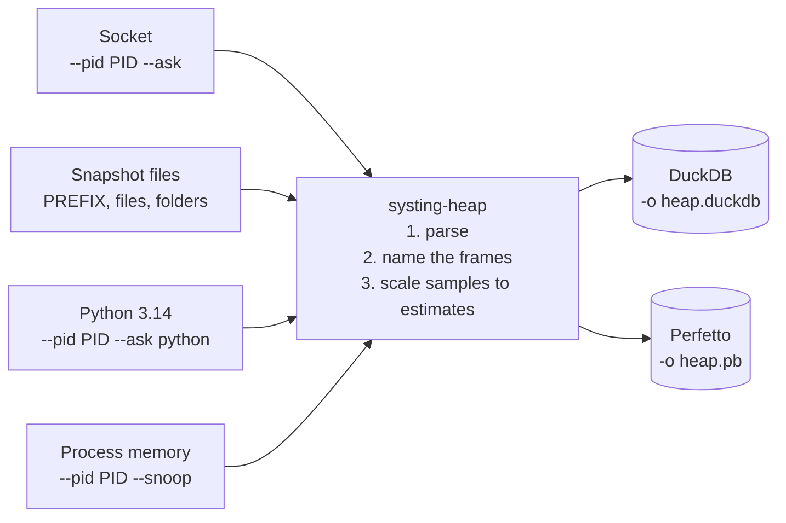

# systing-heap

`systing-heap` turns heap dumps into a systing DuckDB database or a Perfetto trace.

**New here? Start with the guide: [`docs/HEAP_SNAPSHOTS.md`](../docs/HEAP_SNAPSHOTS.md).**
It explains how heap profiling works and how to set a service up. This page is the reference for the tool itself.

> Heap profiling in systing is still experimental. See the note at the top of [the guide](../docs/HEAP_SNAPSHOTS.md).

| Section | What is in it |
|---|---|
| [What it does](#what-it-does) | Inputs and outputs at a glance |
| [Commands](#commands) | Every way to run it |
| [Options](#options) | Every flag |
| [Snapshot files: what is loaded and deleted](#snapshot-files-what-is-loaded-and-deleted) | The rules for a prefix input |
| [Reading a container from outside](#reading-a-container-from-outside) | `--pid` and `--root-fd` |
| [How frames get their names](#how-frames-get-their-names) | Symbolization |
| [Perfetto output](#perfetto-output) | What the trace holds |
| [Sampling and estimates](#sampling-and-estimates) | Why to use the `est_*` columns |
| [Tables](#tables), [Queries](#queries) | The database |
| [Example](#example) | A program to try it on |

## What it does

A heap dump lists, for each call stack, the objects and bytes a process had allocated from it and not yet freed at one moment.
It is not a recording of `malloc` and `free` calls. systing's `memory-alloc` recorder does that.



The database has systing's full schema. Stacks go into the same `frame` and `stack` tables every systing recorder uses, next to three heap tables.
It opens in `systing-analyze` and merges with other traces like any capture.

**Formats.** The format is chosen by file extension. `--format` overrides it.

| Extension | Format | Status |
|---|---|---|
| `.heap` | jemalloc `prof.dump` (`heap_v2`) | Supported |
| `.pb.gz`, `.pprof`, `.pb` | Go's pprof heap profile (`/debug/pprof/heap`) | Supported; frames keep the names and lines the file has |

gperftools (tcmalloc) also writes `.heap` files. The parser checks the first line and refuses those with a clear error.

## Commands

```bash
cargo build --release -p systing-heap
```

| Goal | Command |
|---|---|
| A dump now, over the service's socket | `systing-heap -o heap.duckdb --pid PID --ask` |
| The newest snapshot file of each process. **Deletes the older ones.** | `systing-heap -o heap.duckdb PREFIX` |
| The same, but only show what would happen | `systing-heap -o heap.duckdb PREFIX --dry-run` |
| The newest of each process, delete nothing | `systing-heap -o heap.duckdb PREFIX --latest-only` |
| Every snapshot file, delete nothing | `systing-heap -o heap.duckdb PREFIX --keep-all` |
| Named files or a folder. Never deletes. | `systing-heap -o heap.duckdb a.heap b.heap ./snapshots/` |
| A container's files, read from the host | `systing-heap -o heap.duckdb --pid PID --latest-only PREFIX` |
| A dump now from CPython 3.14, nothing added to it | `systing-heap -o heap.duckdb --pid PID --ask python` |
| The profile read from memory (jemalloc, or a Go program's own heap profile) | `systing-heap -o heap.duckdb --pid PID --snoop` |
| Which of these will work on a process | `systing-heap --pid PID --check` |

`PREFIX` is the `prof_prefix` given to jemalloc, such as `/heap-dumps/jeprof`.
`PID` is the process id as seen from where the tool runs.

**How an input is understood.** An input that exists as a file or folder is only loaded. Anything else is taken as a `prof_prefix`, and that is the only mode that deletes files.

**The output is replaced on every run.** It is written to a temporary file next to it and renamed into place, so a failed run leaves the previous output whole.

**Ids.** Snapshots get ids in dump order: by process id, then by jemalloc's sequence number. All go under one trace id (`--trace-id`, default `heap`).

## Options

| Option | Meaning | Goes with |
|---|---|---|
| `-o, --output FILE` | A DuckDB database, or a Perfetto trace when the name ends in `.pb`, `.perfetto`, `.pftrace` or `.perfetto-trace` | Required, except with `--check`, which refuses it |
| `--format FORMAT` | Read file and folder inputs as this format instead of going by extension | File inputs |
| `--trace-id ID` | The trace id for every snapshot. Default `heap`. | Anything |
| `--dry-run` | Print what would be loaded and deleted, and change nothing | A prefix |
| `--latest-only` | Load the newest snapshot per process and delete nothing | A prefix. Not with `--keep-all`. |
| `--keep-all` | Load every snapshot and delete nothing | A prefix. Not with `--latest-only`. |
| `--perf-map-dir DIR` | Where to look first for the files that name Python frames: `pycode-<pid>-<token>.map` and `perf-<pid>.map` | Anything but `--check` |
| `-p, --pid PID` | Resolve every path inside this process's root (`/proc/PID/root`) | Required by `--ask`, `--snoop` and `--check`. Not with `--root-fd`. |
| `--root-fd N` | Like `--pid`, with a folder the caller has already opened as descriptor `N` | A prefix. Not with `--pid`. |
| `--ask [responder\|python]` | Ask the process for a dump now. Alone it means `responder`, the socket. | `--pid`. No inputs. |
| `--ask-dir DIR` | The folder with the socket, or for `python` the folder to put the script in, as the process sees it. See below for the default. | `--ask` or `--check` |
| `--ask-wait SECONDS` | How long to wait for an answer, 1 to 3600. Default 30. | `--ask` |
| `--snoop` | Read the profile from the process's memory | `--pid`. No inputs. |
| `--check` | Load nothing. Report what the process has and which commands will work. | `--pid`. No inputs, no `-o`. |

`--ask`, `--snoop` and `--check` exclude one another, and none of them takes `--format`, `--dry-run`, `--latest-only` or `--keep-all`.

**Where `--ask` looks without `--ask-dir`**

| | Looks in |
|---|---|
| The socket | The folder named by `SYSTING_HEAP_HOOKS_SOCKET_DIR` in the environment the process was **started** with, then its `/tmp` |
| The script for `--ask python` | The process's `/tmp` |

Pass `--ask-dir` when the service gave `listen()` another folder in a call. Pass it too when the variable's value is ignored: a relative path, one with control or invisible characters, one that is not valid text, or one over 4,096 bytes. The value is the process's to choose and is printed in messages, so only a plain one is used.

**`--ask` never falls back to `--ask python`.** The Python way writes to the process's memory, so it has to be asked for by name. A process with no socket gets an error that says what else to try.

**Who may run it.** Everything with `--pid` opens `/proc/PID/root`, which the kernel allows to the process's own user or to a user with `CAP_SYS_PTRACE`. Root on the host has it. Root in another container usually does not. The socket itself answers the service's own user and root. `--ask python`, `--snoop` and `--check` also read the process's memory, which the kernel allows to the same user (subject to `kernel.yama.ptrace_scope`, and only for a dumpable process) or to a user with `CAP_SYS_PTRACE`. Details are in [`docs/HEAP_INTERNALS.md`](../docs/HEAP_INTERNALS.md).

## Snapshot files: what is loaded and deleted

People usually care about the current state, so with a prefix input the tool keeps one snapshot per process and removes the rest.
jemalloc never deletes its own files. Running the tool regularly keeps one per process on disk.

| Question | Rule |
|---|---|
| Which files are considered? | Files directly in the prefix's folder whose names start with the prefix's file name. Subfolders are never read. |
| Which process is a file from? | The number right after the prefix: `<prefix>.<pid>.<seq>…` |
| Which is the newest? | The highest sequence number for that pid. If a name has none, the modification time decides. |
| What is loaded? | Each pid's newest snapshot. If it does not parse, because jemalloc may still be writing it, the newest one that parses is loaded. |
| What is deleted? | That pid's files **older** than the loaded one, and only after the new output is in place and synced. Every deletion is printed. |
| What is kept? | The loaded file, and any newer file that did not parse |

**Safety checks**

- A file is read or deleted only if it is a regular file and its first line is `heap_v2/`. Symlinks are not followed.
- Files that match the prefix but fail those checks, or have no pid, are left alone with a warning.
- Every check and delete goes through one open handle on the folder. A file is deleted only if its name still refers to the file that was examined.

**One pid is one process.** Two processes that write the same pid into one folder count as one. The higher sequence numbers win, so the other's dumps can be deleted. That happens after a restart that gets its old pid back, or with pid 1 in several containers that share a folder. Give each process or container its own folder or prefix.

## Reading a container from outside

A collector on the host can read one container's files without a shell in it.

```bash
systing-heap -o heap.pb --pid 4242 --latest-only /data/heap/jeprof
systing-heap -o heap.pb --root-fd 3 --latest-only /data/heap/jeprof 3< /mnt/kept-root
```

| | `--pid PID` | `--root-fd N` |
|---|---|---|
| The root is | `/proc/PID/root` | A folder the caller opened and left open as descriptor `N` |
| Use it | At a shell | From a program that has already checked which process it means. What it checked is then what is read. It also works on a kept copy of a container's files. |

`PID` is the host's number for the process. It is not the number in the dump's file name, which is the process's own view of its pid.

**What is resolved inside the root:** the inputs, the binaries each dump names, and the places Python maps are looked for, `--perf-map-dir` included. So `/tmp` means the container's `/tmp`, and the binaries are the image's own. The output path is the caller's and is never inside the root. The paths that are printed, and those stored in the output, are the container's.

**What changes with a root**

| | Without a root | With `--pid` or `--root-fd` |
|---|---|---|
| Inputs | Prefixes, files, folders | Prefixes only |
| Native frames | Function, and file and line when there is debug info | **Function only.** Debug info is not read, so there are no inlined frames either. |
| A map in a world-writable folder | Used if you or root own it | Used if root owns it, or the user who owns that process's dump |
| Binaries and Python maps on FUSE or network filesystems | Read | Left unread, with a warning, and their frames stay unnamed. The snapshot files themselves are read wherever they are. |
| Deleting | As above | As above, so a reader that does not own the files should pass `--latest-only` or `--keep-all` |

It needs Linux 5.6 or newer (`openat2`). On an older kernel the run fails. It does not fall back to plain opens.
Why these rules exist is in [`docs/HEAP_INTERNALS.md`](../docs/HEAP_INTERNALS.md).

## How frames get their names

Naming is done offline, after the dump is taken.

1. Every jemalloc dump ends with a copy of the process's memory map.
2. The tool uses it to turn each address into a file and an offset in that file.
3. It reads symbols from that file, on the machine where the tool runs or inside the root given by `--pid`.

So without `--pid` the binaries must exist at the same paths, on the same host or in the same image.

| A frame looks like | Meaning |
|---|---|
| `function (module [file:line]) <0xaddr>` | Named, with debug info |
| `function (module) <0xaddr>` | Named from the symbol table |
| `unknown (module) <0xaddr>` | The file is known, but has no symbol there. Stripped system libraries, such as libc and the distro's jemalloc, have none for their internal functions. |
| `function (python) [file.py:42]` | A Python frame |
| `unknown (python) [unknown]` | A Python frame whose code map was not found |

The tool warns about files that are missing, and about files whose device and inode differ from those in the dump, since they may be another build.
On an overlay filesystem, which most container images use, that pair can differ for the same file. There the warning means "not provably the same file", not "changed".

**Python frames** are named from a file the hooks library writes. Where the tool looks:

| Collected with | Code map (`pycode-<pid>-<token>.map`) |
|---|---|
| The socket | Comes with the dump. Nothing to do. |
| Snapshot files | `--perf-map-dir`, then beside the snapshot |
| `--ask python`, `--snoop` | `--perf-map-dir` only |

A perf map (`perf-<pid>.map`, from perf trampolines) is looked for in `--perf-map-dir`, then beside the snapshot, then in `/tmp`.
How Python frames are recorded is in [`hooks/README.md`](hooks/README.md).

## Perfetto output

```bash
systing-heap -o heap.pb /data/heap/jeprof
```

The snapshots are written as native heap profiles, the format Perfetto's own heap profiler writes.
Open the file at [ui.perfetto.dev](https://ui.perfetto.dev). Each process gets a heap-profile track with a marker per snapshot, and clicking a marker shows its flamegraph.

| Topic | What to know |
|---|---|
| Numbers | The same `est_*` estimates as the database |
| "Unreleased" | The live estimate |
| "Total allocated" | jemalloc's cumulative total if it ran with `prof_accum:true`. Otherwise a lower bound worked out from the live counts. |
| Between snapshots | Each snapshot holds its increase since the one before, and Perfetto adds them up. The flamegraph at a marker shows the state at that snapshot. |
| Times | A marker's time is its dump file's modification time, on the wall clock. Next to a systing capture, whose times are on the boot clock, the markers land far from its events. |
| Which snapshots | With a prefix, **every** snapshot on disk is loaded, since a timeline is for history. The older ones are then deleted as usual, so each run's trace covers the snapshots written since the last run. `--keep-all` deletes nothing, and `--latest-only` loads one per process. |
| Frames | Named after the function alone. The module is the frame's mapping (`[python]` for Python frames), and file and line are its symbols. |
| Build ids | Mappings carry a `systing-heap:<module>` build id, which Perfetto needs to attach symbols. It is not an ELF build id. |

## Sampling and estimates

jemalloc does not record every allocation.
On average it samples one per `sample_period` bytes allocated (`2^lg_prof_sample`, 512 KiB by default), so an allocation of `s` bytes is recorded with probability `1 - exp(-s / sample_period)`.

| At a 16 KiB period | Recorded |
|---|---|
| A 64 KiB buffer | 98% of the time |
| A 256-byte object | About once in 64 |

So a dump's counts are samples, not totals. `systing-heap` scales each stack back up, the way jeprof does:

```text
factor      = 1 / (1 - exp(-(bytes / objects) / sample_period))
est_bytes   = bytes   * factor
est_objects = objects * factor
```

`bytes / objects` is the stack's mean object size, so small objects get a large factor and large ones a factor near 1.

> **Scale first, then add up.**
> The factor depends on object size, so it has to be applied to each stack on its own. Only the scaled values may be added, across stacks, snapshots or machines.
> Adding raw counts first and scaling the sum under-counts small objects badly, as [jemalloc's own notes explain](https://github.com/jemalloc/jemalloc/blob/dev/doc_internal/PROFILING_INTERNALS.md#aggregation-must-be-done-after-unbiasing-samples).
> This is why the tables store an estimate for every row.

**How close it gets.** Measured on a Python program holding 97.1 MB in a mix of small, medium and large objects:

| Sample period | Sum of `est_live_bytes` | Raw sampled bytes, unscaled |
|---|---|---|
| 512 KiB (default) | 86 to 102 MB over three runs | 3% of the heap |
| 16 KiB | Within 2% | 6% of the heap |

A finer period is more accurate, but it costs memory. jemalloc keeps each sampled object in a larger block, and at the 16 KiB period the process's real heap grew from 97 MB to 159 MB.
`heap/tests/estimates.rs` checks this end to end.

**How far to trust one row.** A total over many rows is close. One row is only as good as the samples behind it, about ±1/√`live_objects`.
One sampled 256-byte object at a 16 KiB period reads as 16,512 bytes, give or take all of it. Check `live_objects` before trusting a small stack.

## Tables

### `heap_snapshot`: one row per snapshot

| Column | Meaning |
|---|---|
| `id` | Snapshot id, dense within the trace |
| `format` | `jemalloc`, or `pprof` for a Go heap profile (a file, or read from memory) |
| `source_path` | See the table below |
| `upid` | `process.upid` of the pid the process knows itself by, in its own pid namespace. NULL if a file name has none. |
| `seq` | jemalloc's dump sequence number |
| `dump_trigger` | See the table below |
| `dumped_at_unix_ns` | Wall-clock time. See the table below. |
| `sample_period` | Mean bytes between samples (`2^lg_prof_sample`) |

| `dump_trigger` | The snapshot came from | `source_path` | `dumped_at_unix_ns` |
|---|---|---|---|
| `interval` | A file, written every `lg_prof_interval` bytes | The file | The file's modification time. A copy that does not keep times moves it. |
| `manual` | A file, from `mallctl("prof.dump")` | The file | The same |
| `gdump` | A file, at a new high-water mark | The file | The same |
| `final` | A file, at exit | The file | The same |
| `asked` | `--ask` | The socket, or the dump's file as the process saw it | When the answer was read |
| `snoop` | `--snoop` | `/proc/PID/mem` | When the memory was read |
| `go-snoop` | `--snoop` of a Go program | `/proc/PID/mem` | When the memory was read |
| `pprof` | A Go pprof heap profile file | The file | The profile's own time |

### `heap_sample`: one row per call stack in a snapshot

| Column | Meaning |
|---|---|
| `snapshot_id` | `heap_snapshot.id` |
| `stack_id` | `stack.id` |
| `est_live_objects`, `est_live_bytes` | **Use these.** Estimated objects and bytes allocated from this stack and not yet freed, in the whole process. |
| `est_alloc_objects`, `est_alloc_bytes` | Estimated cumulative allocations since start. 0 unless jemalloc ran with `prof_accum:true`. |
| `live_objects`, `live_bytes`, `alloc_objects`, `alloc_bytes` | The raw sampled counts. **Never add these up as totals.** They tell you how many samples an estimate rests on. |

### `heap_live_read`: how a `--snoop` read went

One row per snapshot read with `--snoop`. None for a dump.

| Column | Meaning |
|---|---|
| `snapshot_id` | `heap_snapshot.id` |
| `found_by` | `symbol`: the library names the profile table. `shape`: a stripped library, so it was found by what it looks like. |
| `object_path` | The file the profile was found in, as the process maps it |
| `sample_period_from` | Where `sample_period` came from: `symbols`, `malloc_conf`, or `default`, which is a guess. The estimates do not depend on it. |
| `walks_redone` | Walks done again, because the table changed or records were skipped |
| `unsteady` | The table was changing during every walk, so stacks may be missing |
| `backtraces_read`, `backtraces_skipped` | Backtrace records read, and those skipped because they were not, or no longer, jemalloc's. Read counts every backtrace, including one with nothing live, which has no `heap_sample` row. |
| `thread_records_read`, `thread_records_skipped` | The same for the per-thread counters. A skipped record's counts are missing from its stack. |
| `links_checked`, `links_out_of_order` | Thread records compared for the order jemalloc keeps them in, and those out of it |
| `counters_checked`, `counters_off` | Thread records whose counters were compared, and those that cannot be jemalloc's |
| `reads`, `bytes_read`, `duration_ms` | What the read cost |

**A read is clean** when `unsteady` is false and `backtraces_skipped`, `thread_records_skipped`, `links_out_of_order` and `counters_off` are all 0.
Clean means nothing was seen to go wrong, not that the counts are exact.
A check with fewer than 8 records (`links_checked`, `counters_checked`) had too little to judge by.

### Good to know

- **Pids are the process's own,** in its pid namespace. Two containers whose main process is pid 1 share one `process` row when read into one database. `source_path` says where each snapshot came from.
- **Merging.** A DuckDB merge keeps these tables. A merge by a schema-25 reader, or an export to parquet and back, drops them without a message. `heap_live_read` dates from schema 28, so an older reader keeps the snapshot and drops how its read went.

## Queries

Ids are per trace, so in a database that holds more than one trace, group by `trace_id` as well.

**Estimated live heap, per snapshot**

```sql
SELECT trace_id, snapshot_id, sum(est_live_bytes) AS est_live_bytes
FROM heap_sample GROUP BY trace_id, snapshot_id ORDER BY trace_id, snapshot_id;
```

**The biggest stacks in each process's newest snapshot**

```sql
WITH newest AS (
  SELECT trace_id, id FROM heap_snapshot
  QUALIFY row_number() OVER (PARTITION BY trace_id, upid ORDER BY seq DESC) = 1
)
SELECT h.est_live_bytes, sf.frame_names
FROM heap_sample h
JOIN newest n ON n.trace_id = h.trace_id AND n.id = h.snapshot_id
JOIN stack_frames sf ON sf.trace_id = h.trace_id AND sf.id = h.stack_id
ORDER BY h.est_live_bytes DESC LIMIT 10;
```

**Live bytes by the function that allocated.** This takes the innermost frame of each stack that is in the program's own binary, `myprogram` here.

```sql
WITH own AS (
  SELECT h.snapshot_id, h.est_live_bytes, arg_max(fr.name, u.idx) AS fn
  FROM heap_sample h
  JOIN stack s ON s.trace_id = h.trace_id AND s.id = h.stack_id,
       unnest(s.frame_ids) WITH ORDINALITY AS u(fid, idx)
  JOIN frame fr ON fr.trace_id = s.trace_id AND fr.id = u.fid
  WHERE fr.name LIKE '%(myprogram%'
  GROUP BY h.trace_id, h.snapshot_id, h.stack_id, h.est_live_bytes
)
SELECT snapshot_id, fn, sum(est_live_bytes) AS est_live_bytes
FROM own GROUP BY ALL ORDER BY snapshot_id, est_live_bytes DESC;
```

**Growth between each process's first and last snapshot, by stack.** Load with `--keep-all`, or there is only one snapshot per process.
Stack ids compare only within one process, and one stack id can have more than one row in a snapshot, hence the sums.
A snapshot whose file name has no pid or no sequence number cannot be ordered, and drops out.

```sql
WITH rows AS (
  SELECT h.*, s.upid, s.seq FROM heap_sample h
  JOIN heap_snapshot s ON s.trace_id = h.trace_id AND s.id = h.snapshot_id
),
ends AS (
  SELECT trace_id, upid, min(seq) AS first_seq, max(seq) AS last_seq
  FROM heap_snapshot GROUP BY trace_id, upid
)
SELECT r.trace_id, r.upid, r.stack_id,
       coalesce(sum(r.est_live_bytes) FILTER (WHERE r.seq = ends.last_seq), 0)
     - coalesce(sum(r.est_live_bytes) FILTER (WHERE r.seq = ends.first_seq), 0) AS growth
FROM rows r JOIN ends USING (trace_id, upid)
GROUP BY ALL ORDER BY growth DESC;
```

**Was each `--snoop` read clean?**

```sql
SELECT s.trace_id, s.id, r.found_by, r.sample_period_from, r.walks_redone,
       NOT r.unsteady
         AND r.backtraces_skipped + r.thread_records_skipped = 0
         AND r.links_out_of_order + r.counters_off = 0 AS clean
FROM heap_snapshot s
JOIN heap_live_read r ON r.trace_id = s.trace_id AND r.snapshot_id = s.id
ORDER BY s.trace_id, s.id;
```

## Example

`examples/jemalloc/` builds a small C program and runs it under jemalloc with profiling on, so jemalloc writes snapshot files on its own. The program never calls jemalloc directly.
It needs a C compiler and a jemalloc built with profiling.

```bash
heap/examples/jemalloc/run.sh /tmp/snaps     # writes jeprof.<pid>.<seq>.<kind>.heap files
systing-heap -o /tmp/heap.duckdb /tmp/snaps
```

| Function | What `est_live_bytes` shows |
|---|---|
| `leak_buffers` | Grows about 2 MiB a round, to about 16 MiB in the final snapshot |
| `build_list` | Grows to about 3 MB, then the program frees the list. Unscaled it reads about 45 KB: its 256-byte objects are the ones sampling misses most. |
| `cache_fill` | Stays at about 1 MiB |
| `churn` | Does not appear. It frees everything it allocates. |
