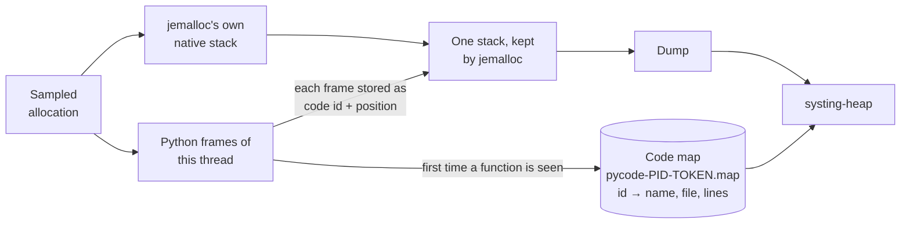

# systing-heap hooks

The small library a service loads to get more than jemalloc gives on its own.

**New here? Start with the guide: [`docs/HEAP_SNAPSHOTS.md`](../../docs/HEAP_SNAPSHOTS.md).**
This page is the reference for the library.

It has two independent parts. A service can use either without the other, and a service that needs neither loads nothing: snapshot files, `--snoop` and `--ask python` work without it.

| Part | What it does | Status |
|---|---|---|
| **The responder** | One thread that answers `systing-heap --ask` on a Unix socket | Experimental |
| **The backtraces** | Change how jemalloc captures the stack of a sampled allocation, so stacks show Python functions | Supported |

## What to build and load

```bash
make -C heap/hooks              # both libraries, in heap/hooks/
make -C heap/hooks OUT=/dir     # somewhere else
make -C heap/hooks responder    # only one: "responder" or "hooks"
```

It needs a C compiler and `make`. No Python headers, no libunwind. Both libraries link only `libdl` and `libpthread`.

| File | Contains | Load it into |
|---|---|---|
| `libsysting_heap_responder.so` | The responder. Nothing about Python. About a twentieth of the other's size in memory (14 KB against 276 KB). | Native services |
| `libsysting_heap_hooks.so` | The responder and the backtraces | Python services |
| `systing_heap_hooks.py` | The Python helper. Keep it next to `libsysting_heap_hooks.so`. | Python services |
| `systing_heap_hooks.h` | The C API | C, C++ and Rust services that call the library |

**A library that is loaded but not asked does nothing:** no thread, no file, no socket.

| To get | Library | In the service |
|---|---|---|
| The socket, no code change | `libsysting_heap_responder.so`, preloaded | `SYSTING_HEAP_HOOKS_LISTEN=1` in the environment |
| The socket, from Python | `libsysting_heap_hooks.so` and the helper | `listen()` |
| The socket, from C, C++ or Rust | `libsysting_heap_responder.so`, linked | `systing_heap_hooks_listen(NULL)` |
| Python functions with file and line | `libsysting_heap_hooks.so` and the helper | `install(backtrace="python")` |
| Python functions through perf trampolines | The same, and `libunwind.so.8` in the image | `install(backtrace="libunwind")` |

## Reference

### Environment variables

| Variable | Read by | Meaning |
|---|---|---|
| `SYSTING_HEAP_HOOKS_LISTEN` (experimental) | Either library, when it loads | `1`: start the socket. `fork`: also in every process this one forks. Unset, empty or `0`: do nothing. Anything else: one line on stderr, and no socket. |
| `SYSTING_HEAP_HOOKS_LISTEN_ONLY` (experimental) | The same | Only the program whose executable has this file name listens. For a Python service that is the interpreter's, such as `python3.13`; `readlink /proc/PID/exe` shows it. |
| `SYSTING_HEAP_HOOKS_SOCKET_DIR` (experimental) | The responder, and `systing-heap --ask` | The folder for the socket file. Default `/tmp`. |
| `SYSTING_HEAP_HOOKS_LIB` | The Python helper | The path of the library, when it is not next to the `.py` file |
| `SYSTING_HEAP_HOOKS_LIBUNWIND` | `backtrace="libunwind"` | The libunwind to load in place of `libunwind.so.8` |

All but `SYSTING_HEAP_HOOKS_LIB` are ignored in a setuid or file-capability program (`secure_getenv`).

### Python

```python
import systing_heap_hooks
```

| Call | Does | Returns |
|---|---|---|
| `install(backtrace="python")` | Puts Python functions in the stacks | `{'backtrace': …, 'trampolines': …, 'reasons': […]}`: what is active now, and why anything was skipped |
| `install(backtrace="libunwind")` | Turns on perf trampolines and walks through them | The same |
| `install(backtrace="default", trampolines=False)` | Puts jemalloc's own backtrace back | The same |
| `listen(dir=None)` (experimental) | Starts the socket, here and in every process forked from here | The socket's path, or `None` with a warning |
| `keep_perf_map_across_fork()` | Trampolines only, Python 3.13+: each forked child adds the parent's perf map to its own | Whether it is on |

- **Always pass `backtrace=`.** The default is `"libunwind"`, not `"python"`.
- **`trampolines=`** turns Python's perf trampolines on or off. Left out, they are turned **on** for every backtrace except `"python"`, `"default"` included, and they slow every Python call.
- **Nothing here stops the service.** What cannot be done is skipped with a warning, and `reasons` says why. Pass `strict=True` to raise instead.
- **`install()` applies from then on.** Allocations sampled before it have native stacks.
- **A second `listen()` changes nothing.** A process that already listens keeps its socket, whatever folder is passed.
- `lib=` names the library file. With the responder-only library, `listen()` works and `install()` explains why it cannot.

### C

```c
#include "systing_heap_hooks.h"
```

| Function | Does |
|---|---|
| `int systing_heap_hooks_listen(const char *dir)` (experimental) | Starts the socket. `NULL`: the variable, then `/tmp`. |
| `const char *systing_heap_hooks_socket(void)` (experimental) | The socket's path, or `""` |
| `int systing_heap_hooks_install(const char *backtrace)` | `"python"`, `"libunwind"` or `"default"` |
| `int systing_heap_hooks_prepare(const char *backtrace)` | Gets ready without installing, so the walk can be checked first |
| `const char *systing_heap_hooks_active(void)` | The backtrace in use |
| `const char *systing_heap_hooks_strerror(int code)` | What a return code means. `SHH_OK` is 0. |

The responder-only library has `listen`, `socket` and `strerror`.

**Installing `"python"` from C skips a safety check.** The Python helper compares the library's walk with Python's own view of the stack before it installs, and only Python can supply that view.
From C the library goes by the interpreter's version alone. On a Python of a listed version that is laid out differently, every object is still checked for its type and every read is still made by the kernel, so stacks come out short or unnamed. Nothing faults.
A C caller that wants the check calls `prepare("python")`, compares `systing_heap_hooks_python_check()` with what it knows the stack to be, and then installs.

## The responder (experimental)

> **Experimental.** Its variables, functions and protocol may still change, along with `systing-heap --ask`. Do not build automation on it yet.

### What it does in a service

| Topic | Behaviour |
|---|---|
| Thread | One, named `heap-responder`. It sleeps in `accept()` until someone asks. Every signal is blocked on it, so none of the program's handlers run there. |
| Socket | A file named `.systing-heap.<pid>`, mode `0600`. The pid is the process's own view of itself. The whole path must fit in 107 bytes. |
| Who may ask | The process's own user, and root. The caller's credentials are checked before a byte of the request is read. |
| The dump | jemalloc writes it into an in-memory file (`memfd_create`), which is sealed and handed over as a file descriptor. It is never written to disk. |
| The code map | Handed over with the dump when `backtrace="python"` is on, so the tool needs no path for it |
| Requests | One at a time. A caller that says or reads nothing is dropped after 5 seconds. |
| Paused sampling | The answer says whether jemalloc's `prof.active` is on, and the tool warns when it is not |
| At exit | The process removes its socket file |

### In production

| Do | Why |
|---|---|
| **Give the socket a folder of the service's own** (`SYSTING_HEAP_HOOKS_SOCKET_DIR`) | In `/tmp` any user can create the name first. That blocks the socket. It cannot redirect anything: `listen()` fails, and the tool checks that whoever answers is the process it asked about. |
| **Set `SYSTING_HEAP_HOOKS_LISTEN_ONLY`** with the environment switch | See below |
| **One folder per container** | The name has the pid as the process sees it. Two containers that share a folder collide on small pids, and the second `listen()` fails. |

### The environment switch

```yaml
env:
  - name: LD_PRELOAD              # jemalloc first: the library looks for it as it loads
    value: /usr/lib/x86_64-linux-gnu/libjemalloc.so.2:/opt/systing/libsysting_heap_responder.so
  - name: MALLOC_CONF
    value: prof:true
  - name: SYSTING_HEAP_HOOKS_LISTEN
    value: "1"
  - name: SYSTING_HEAP_HOOKS_LISTEN_ONLY
    value: my-service
  - name: SYSTING_HEAP_HOOKS_SOCKET_DIR
    value: /run/my-service
```

The service's code is unchanged. Its environment has three changes: `prof:true`, which cannot be turned on later, the preloaded library, and the switch.

**The environment is inherited.** Without `LISTEN_ONLY`, every program the service starts also listens: a shell command, a helper.

| Consequence | Detail |
|---|---|
| Extra threads and sockets | One of each per program, for as long as it runs |
| Noise | A program without jemalloc or profiling prints one line on its stderr |
| **Some programs break** | The program has a second thread before its own code starts. Linux refuses a new user namespace to a program with more than one thread, so `unshare --user` and sandbox launchers that do the same fail with `Invalid argument`. This was reproduced. |

With `LISTEN_ONLY` set, every other program does nothing and prints nothing.
**So does the service itself if the name stops matching.** An image that moves from `python3.13` to `python3.14` stops listening without a message.
The other ways out: the service removes the variables from the environment it gives its children, or calls `listen()` itself.

**When it cannot listen** there is no caller to tell, so it prints one line on stderr and the service runs on:

```text
systing_heap_hooks: SYSTING_HEAP_HOOKS_LISTEN=1 (pid 4242): jemalloc profiling is off (MALLOC_CONF has no prof:true)
```

### Fork

The thread does not exist in a forked child, and the child closes its copy of the parent's socket.

| How the socket was started | In a forked child |
|---|---|
| `listen()` from Python | Starts again by itself, in the folder given to the first `listen()` |
| `SYSTING_HEAP_HOOKS_LISTEN=fork` | Starts again by itself |
| `SYSTING_HEAP_HOOKS_LISTEN=1`, or the C function | No socket, until the child calls `listen` itself |

- **A warning from Python.** Python 3.12 and later print a `DeprecationWarning` when a process with more than one thread forks, and the responder is a thread.
- **`=fork` relies on glibc.** The child's thread is started inside `fork()`. The manual allows the forked child of a threaded program only a short list of simple calls, and starting a thread is not one of them. It works because glibc restores its own locks before it runs any library's fork handler (read in glibc 2.39), and because this library calls jemalloc before registering its handler, so jemalloc's locks are restored by then too. That is an implementation's order, not a promise. Nothing is known about musl.
- **A worker that cannot listen.** With `=fork` it prints the same one line on stderr, with its pid. A child of Python's `listen()` fails silently.

### Costs and limits

| Topic | Detail |
|---|---|
| Memory | The dump's pages count against the service's own memory limit until the tool has read and closed it. A dump is a few KB to a few MB, and the service most likely to be asked is one near its limit. |
| No rate limit | Each request is a whole `prof.dump` on the responder's thread. Whoever may ask can already stop the service, so this gives nobody new power. It is a cost. |
| A small widening | Where `kernel.yama.ptrace_scope` is 1 or more, one process cannot read another of the same user. Through the socket such a process can get the heap profile (stacks, sizes, mapped file paths) and the Python code map (function names, files, lines). It gets no memory contents. |
| One file may be written | With `backtrace="python"`, the first request to a forked worker creates that worker's code map file, as its first new function would have. The responder-only library writes nothing but its socket. |
| One lock is shared | While that file is made, the responder holds the Python backtrace's lock. A thread whose allocation is sampled at that moment waits for it. |
| Files left behind | A process that is killed, leaves through `_exit()` (as `multiprocessing` workers do) or goes on to `execve` another program leaves its socket file. The next process to listen under that name takes it over. |
| Closed descriptors | If the program closes descriptors it did not open, the number may be reused. The thread notices that it is no longer its socket and ends, and `listen()` can be called again. |

## Python functions in the stacks

```text
_start → … → outer (python) [app.py:12] → leak_in_python (python) [app.py:10] → PyByteArray… → malloc
```

**Use `backtrace="python"`.** Use trampolines with `backtrace="libunwind"` only for a Python it refuses: newer than 3.14, free-threaded or otherwise built differently, or a process that may not read its own memory through the kernel.

| Setup | Stacks show | Cost |
|---|---|---|
| `backtrace="python"` | Every Python function with file and line, among the native frames | Per sampled allocation only |
| Trampolines and `backtrace="libunwind"` | Every Python function with its file, no line | Every Python call, and per sampled allocation |
| Trampolines and a jemalloc built with `--enable-prof-libunwind`, no hook | The same, expected. Not tested. | The same |
| Trampolines and jemalloc's default | Only the innermost Python function | Every Python call |
| Neither | Native frames only: the interpreter's C functions | None |

### How `backtrace="python"` works

When jemalloc samples an allocation, the hook takes jemalloc's own native stack and adds the Python frames of the thread that allocated, read from the interpreter's frame chain.
Nothing happens between samples, so Python runs at full speed.
It also works on threads that have released the GIL: an allocation inside numpy or torch shows its Python callers.



| Topic | Detail |
|---|---|
| **The code map** | jemalloc keeps a stack as addresses, so each Python frame is stored as a 64-bit value that no address can equal: a code id and an instruction index. The ids are named in `pycode-<pid>-<token>.map`, one line per Python function. |
| **Where it is written** | In the folder of jemalloc's `prof_prefix`, or the working directory if there is none. **It must be writable**, or the backtrace is not installed. |
| **Keep it with the dumps** | Without it, Python frames read `unknown (python) [unknown]`. The socket sends it along with the dump. |
| **A dump names its own map** | The token is also the name of a mapping in the process, which the dump records. A later process with the same pid cannot name another's frames. |
| **Checked before use** | `install()` compares what the hook reads with what Python says the stack is: every frame's code object, position, names and line table. If they differ, it is not installed and `reasons` says so. |
| **Forked workers** | Nothing to do. Each child writes its own map, which starts with the parent's lines, so what the parent allocated before the fork is named too. The map is made when the worker's first allocation is sampled, or at the first request on its socket. A worker that writes a dump **file** before either has no map yet, and its Python frames read `unknown (python) [unknown]`. |
| **At exit** | The helper turns the walk off as the interpreter exits. Allocations sampled after that have native stacks. |
| **Threads Python never saw** | A native thread pool has no Python frames. Its stacks are native. |
| **Depth** | jemalloc 5.3 keeps 128 frames. Python frames get at most 64 of them, the innermost, and the native stack gets the rest: past 128 in all it loses its outermost frames. On such a truncated stack the Python frames may not pair up with the interpreter's native frames, and are then placed in front of them as one block. |
| **Which frames** | The ones Python shows in a traceback |
| **Cleanup** | Code maps are not deleted. Each process leaves one, created like the dumps: mode `0644` less the umask. Whoever can read the dumps can read the function names and source paths in it. |
| **Ceilings** | 128 MiB per map and 98,304 functions, fewer if many land in the same part of the hook's table. Functions first met past these read `unknown (python) [unknown]`. `systing-heap` skips a line with a name over 1,024 characters, a file over 4,096 or a line table over 64 KiB, and prints U+FFFD in place of a control character in a name. |

### Safety rules of `backtrace="python"`

It runs inside `malloc`, in the service's process, mostly on threads that do not hold the GIL. So:

| Rule | Why it matters |
|---|---|
| A thread walks only its own frames | No other thread's state is touched |
| No pointer from Python is dereferenced. Everything is read with `process_vm_readv` on the process itself, or `/proc/self/mem` where seccomp refuses that. | A bad address is an error, not a crash. If neither works, the backtrace is not installed. |
| It calls only three Python functions: two that return the thread's state, one that says the interpreter is exiting | It never takes the GIL, touches a reference count or allocates |
| Every loop and length is bounded, and each object's type is checked before use | Garbage gives a short or unnamed stack |
| It keeps no descriptor open for the code map, which is opened for each line and closed | A program that closes descriptors it did not open never gets our line in its own file |
| Where reads have to go through `/proc/self/mem`, that one descriptor stays open. A forked child closes its parent's and opens its own. | A child never reads its parent's memory |
| The code map is opened without blocking, and written only if it is still the regular file that was made, unchanged since the last line | Someone else with write access to the folder cannot stall an allocation or redirect the write. A map that was touched by anything else stops growing. |
| jemalloc's own backtrace is called exactly as jemalloc calls it | The native stack is what it would have been |

### Perf trampolines

For a Python that `backtrace="python"` refuses. Two things make it work:

- **Perf trampolines** (Python 3.12+). Python gives each function a small piece of generated code, so a native stack shows one frame per Python function, and names that code in `/tmp/perf-<pid>.map`.
- **A backtrace that walks through them.** The distro's jemalloc uses libgcc's unwinder, which stops at the first trampoline. libunwind walks through, and the hook makes jemalloc use it.

```python
print(systing_heap_hooks.install(backtrace="libunwind", trampolines=True))
# {'backtrace': 'libunwind', 'trampolines': True, 'reasons': []}
```

| Topic | Detail |
|---|---|
| **Turn them on early** | Trampolines wrap only functions called after they are on. A frame that is already running, such as a long-lived main loop, has none in any later snapshot. `PYTHONPERFSUPPORT=1` turns them on at startup. |
| **Forked workers** | Each worker starts its own perf map, so frames inherited from the parent are unnamed. On 3.13+, call `keep_perf_map_across_fork()` once in the parent, before it forks. |
| **No line numbers** | A trampoline is per function. Frames name the function and file. Application code has no module prefix, so two functions with the same qualified name in files with the same base name count as one frame. |
| **Keep the perf map** | In a container `/tmp` is the container's own, so copy the map out with the dumps or use `--pid`. Without it frames read `unknown ([anon:exec])`. |
| **Which maps are trusted** | A regular file of at most 256 MiB. In a world-writable folder, only one that you or root own, as `perf` requires. A refused candidate falls through to the next place. A map is consulted only for addresses in anonymous executable memory, so a stale one cannot name data. |
| **Joining with captures** | Names match systing's pystacks apart from the line. Drop it to join: `regexp_replace(name, ':\d+\]$', ']')`. |

### The two compared

**What the stacks show**

| | `backtrace="python"` | Trampolines and `backtrace="libunwind"` |
|---|---|---|
| A Python frame | Function, file and line | Function and file |
| Frames already running when it is turned on | Shown | Unnamed, unless `PYTHONPERFSUPPORT=1` was set at startup |
| A deep stack (jemalloc keeps 128 frames) | The innermost 64 Python frames | About 40 Python frames, since each takes three of the 128. Past about 36 deep, the outermost frames are lost. |
| An allocation made with the GIL released | Python callers shown | Python callers shown |
| A thread Python never saw | Native frames only | Native frames only |
| A forked worker | Nothing to do | One more call on 3.13+. On 3.12 inherited frames are unnamed. |

**What it costs.** Measured on CPython 3.12.3 and 3.13.15, x86-64, one core, the distro's jemalloc 5.3 at `lg_prof_sample:19`.

| | `backtrace="python"` | Trampolines and `backtrace="libunwind"` |
|---|---|---|
| Python function calls, on a benchmark made only of calls | No change | 40% to 65% slower, about 16 ns a call. Far less for code that spends its time in C. |
| A sampled allocation at 30 Python frames, on top of jemalloc's own 4 µs | 25 to 26 µs | 9 µs on 3.12, 20 µs on 3.13 |
| The same, per GiB allocated | About 50 ms | 19 to 41 ms, plus the cost on every call |
| System calls per sampled allocation | About 37 (`process_vm_readv`) | About 39 (libunwind checks each address) |
| Threads sampled at the same moment | Walk side by side | One at a time: a lock is held for the whole unwind |
| A mixed workload (tokenize, parse and compile 150 files) | No difference above noise | No difference above noise |
| Memory | A 5 MiB table is mapped. Only the pages used are resident. | 64 KiB of generated code for 1,300 functions |
| Files | About 1 KiB per function that was in a sampled stack | About 90 bytes per function that was ever called |

`python` costs more per sample and nothing per call. It is the cheaper of the two once a program makes more than about 300 (3.13) to 1,000 (3.12) Python calls per sampled allocation, which at the default period is per 512 KiB allocated.

**What can go wrong**

| | `backtrace="python"` | Trampolines and `backtrace="libunwind"` |
|---|---|---|
| Depends on | CPython's private structures, by offsets kept per minor version | A feature CPython supports, and libunwind8 in the image |
| A new Python version | Refused until its offsets are added. Stacks are native until then. | Nothing depends on the version |
| A Python laid out differently | Refused by the check in `install()` | Nothing depends on the layout |
| A bad pointer | Cannot fault | libunwind checks each address before reading it |
| Changes in the process | Nothing between samples | How every Python function is called, for the life of the process. It also maps executable memory at run time. |
| Needs from the environment | `process_vm_readv` on itself, or `/proc/self/mem` | `libunwind.so.8`, and a writable `/tmp` |
| Which process a map belongs to | The dump names its map by a token | By pid alone: a map left by an earlier process with the same pid is not told apart |
| Where the map is | Beside the dumps | In the container's `/tmp` |

## For maintainers

```text
heap/hooks/
  systing_heap_hooks.h    the C API, both parts
  systing_heap_hooks.py   the Python helper
  Makefile
  common/                 shared: finding jemalloc, fork handling, error texts
  backtrace/              backtrace.c, python.c, py_offsets.h
  responder/              responder.c
```

- **The two parts do not call each other.** Each is built from its own folder and `common/`. The one thing that passes between them is the code map: the Python backtrace registers how to ask for it, through `common/`, and the responder hands over what it is given.
- **`backtrace/py_offsets.h`** holds the CPython struct offsets, by version. It is rendered from systing's pystacks offsets. `cargo test -p systing-heap hook_offsets` fails when the two differ, and rewrites the header when run with `SYSTING_HEAP_UPDATE_OFFSETS=1`.
- **A new Python minor version** needs its offsets added to systing's pystacks bindings (`scripts/generate_python_bindings.py`) and to `MINORS` in `heap/src/hook_offsets.rs`.
- **The socket's protocol** is described at the top of `responder/responder.c`.
