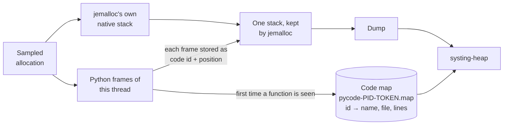
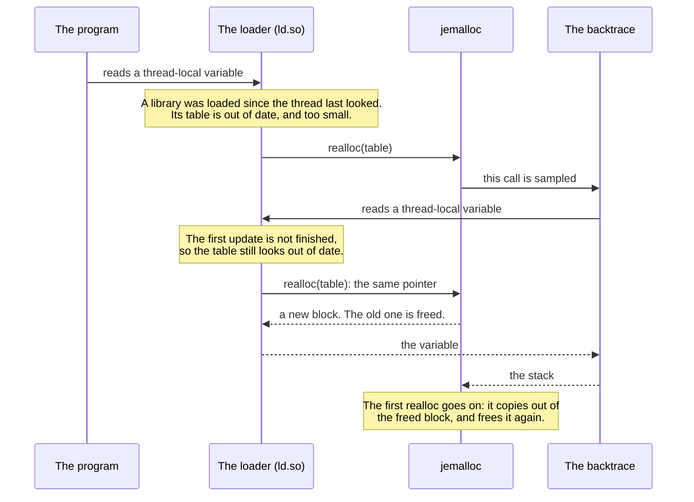

# systing-heap hooks

The small library a service loads to get more than jemalloc gives on its own.

**New here? Start with the guide: [`docs/HEAP_SNAPSHOTS.md`](../../docs/HEAP_SNAPSHOTS.md).**
This page is the reference for the library.

> Heap profiling in systing is still experimental. See the note at the top of [the guide](../../docs/HEAP_SNAPSHOTS.md).

It has two independent parts. A service can use either without the other, and a service that needs neither loads nothing: snapshot files, `--snoop` and `--ask python` work without it.

| Part | What it does |
|---|---|
| **The responder** | One thread that answers `systing-heap --ask` on a Unix socket |
| **The backtraces** | Change how jemalloc captures the stack of a sampled allocation, so stacks show Python functions |

## What to build and load

```bash
make -C heap/hooks              # both libraries, in heap/hooks/
make -C heap/hooks OUT=/dir     # somewhere else
make -C heap/hooks responder    # only one: "responder" or "hooks"
```

It needs a C compiler and `make`. No Python headers, no libunwind. Both libraries link only `libdl` and `libpthread`.

| File | Contains | Load it into |
|---|---|---|
| `libsysting_heap_responder.so` | The responder. Nothing about Python. About a twentieth of the other's size in memory (14 KB against 276 KB). | Native services |
| `libsysting_heap_hooks.so` | The responder and the backtraces | Python services |
| `systing_heap_hooks.py` | The Python helper. Keep it next to `libsysting_heap_hooks.so`. | Python services |
| `systing_heap_hooks.h` | The C API | C, C++ and Rust services that call the library |

**A library that is loaded but not asked does nothing:** no thread, no file, no socket.

| To get | Library | In the service |
|---|---|---|
| The socket, no code change | `libsysting_heap_responder.so`, preloaded | `SYSTING_HEAP_HOOKS_LISTEN=1` in the environment |
| The socket, from Python | `libsysting_heap_hooks.so` and the helper | `listen()` |
| The socket, from C, C++ or Rust | `libsysting_heap_responder.so`, linked | `systing_heap_hooks_listen(NULL)` |
| Python functions with file and line | `libsysting_heap_hooks.so` and the helper | `install(backtrace="python")` |
| Python functions through perf trampolines | The same, and `libunwind.so.8` in the image | `install(backtrace="libunwind")` |

## Reference

### Environment variables

| Variable | Read by | Meaning |
|---|---|---|
| `SYSTING_HEAP_HOOKS_LISTEN` | Either library, when it loads | `1`: start the socket. `fork`: also in every process this one forks. Unset, empty or `0`: do nothing. Anything else: one line on stderr, and no socket. |
| `SYSTING_HEAP_HOOKS_LISTEN_ONLY` | The same | Only the program whose executable has this file name listens. For a Python service that is the interpreter's, such as `python3.13`; `readlink /proc/PID/exe` shows it. |
| `SYSTING_HEAP_HOOKS_SOCKET_DIR` | The responder, and `systing-heap --ask` | The folder for the socket file. Default `/tmp`. |
| `SYSTING_HEAP_HOOKS_LIB` | The Python helper | The path of the library, when it is not next to the `.py` file |
| `SYSTING_HEAP_HOOKS_LIBUNWIND` | `backtrace="libunwind"` | The libunwind to load in place of `libunwind.so.8` |

All but `SYSTING_HEAP_HOOKS_LIB` are ignored in a setuid or file-capability program (`secure_getenv`).

### Python

```python
import systing_heap_hooks
```

| Call | Does | Returns |
|---|---|---|
| `install(backtrace="python")` | Puts Python functions in the stacks | `{'backtrace': …, 'trampolines': …, 'reasons': […]}`: what is active now, and why anything was skipped |
| `install(backtrace="libunwind")` | Turns on perf trampolines and walks through them | The same |
| `install(backtrace="default", trampolines=False)` | Puts jemalloc's own backtrace back | The same |
| `listen(dir=None)` | Starts the socket, here and in every process forked from here | The socket's path, or `None` with a warning |
| `keep_perf_map_across_fork()` | Trampolines only, Python 3.13+: each forked child adds the parent's perf map to its own | Whether it is on |

- **Always pass `backtrace=`.** The default is `"libunwind"`, not `"python"`.
- **`trampolines=`** turns Python's perf trampolines on or off. Left out, they are turned **on** for every backtrace except `"python"`, `"default"` included, and they slow every Python call.
- **Nothing here stops the service.** What cannot be done is skipped with a warning, and `reasons` says why. Pass `strict=True` to raise instead.
- **`install()` applies from then on.** Allocations sampled before it have native stacks.
- **A second `listen()` changes nothing.** A process that already listens keeps its socket, whatever folder is passed.
- `lib=` names the library file. With the responder-only library, `listen()` works and `install()` explains why it cannot.

### C

```c
#include "systing_heap_hooks.h"
```

| Function | Does |
|---|---|
| `int systing_heap_hooks_listen(const char *dir)` | Starts the socket. `NULL`: the variable, then `/tmp`. |
| `const char *systing_heap_hooks_socket(void)` | The socket's path, or `""` |
| `int systing_heap_hooks_install(const char *backtrace)` | `"python"`, `"libunwind"` or `"default"` |
| `int systing_heap_hooks_prepare(const char *backtrace)` | Gets ready without installing, so the walk can be checked first |
| `const char *systing_heap_hooks_active(void)` | The backtrace in use |
| `const char *systing_heap_hooks_strerror(int code)` | What a return code means. `SHH_OK` is 0. |

The responder-only library has `listen`, `socket` and `strerror`.

**Installing `"python"` from C skips a safety check.** The Python helper compares the library's walk with Python's own view of the stack before it installs, and only Python can supply that view.
From C the library goes by the interpreter's version alone. On a Python of a listed version that is laid out differently, every object is still checked for its type and every read is still made by the kernel, so stacks come out short or unnamed. Nothing faults.
A C caller that wants the check calls `prepare("python")`, compares `systing_heap_hooks_python_check()` with what it knows the stack to be, and then installs.

## The responder

### What it does in a service

| Topic | Behaviour |
|---|---|
| Thread | One, named `heap-responder`. It sleeps in `accept()` until someone asks. Every signal is blocked on it, so none of the program's handlers run there. |
| Socket | A file named `.systing-heap.<pid>`, mode `0600`. The pid is the process's own view of itself. The whole path must fit in 107 bytes. |
| Who may ask | The process's own user, and root. The caller's credentials are checked before a byte of the request is read. |
| The dump | jemalloc writes it into an in-memory file (`memfd_create`), which is sealed and handed over as a file descriptor. It is never written to disk. |
| The code map | Handed over with the dump when `backtrace="python"` is on, so the tool needs no path for it |
| Requests | One at a time. A caller that says or reads nothing is dropped after 5 seconds. |
| Paused sampling | The answer says whether jemalloc's `prof.active` is on, and the tool warns when it is not |
| At exit | The process removes its socket file |

### In production

| Do | Why |
|---|---|
| **Give the socket a folder of the service's own** (`SYSTING_HEAP_HOOKS_SOCKET_DIR`) | In `/tmp` any user can create the name first. That blocks the socket. It cannot redirect anything: `listen()` fails, and the tool checks that whoever answers is the process it asked about. |
| **Set `SYSTING_HEAP_HOOKS_LISTEN_ONLY`** with the environment switch | See below |
| **One folder per container** | The name has the pid as the process sees it. Two containers that share a folder collide on small pids, and the second `listen()` fails. |

### The environment switch

```yaml
env:
  - name: LD_PRELOAD              # jemalloc first: the library looks for it as it loads
    value: /usr/lib/x86_64-linux-gnu/libjemalloc.so.2:/opt/systing/libsysting_heap_responder.so
  - name: MALLOC_CONF
    value: prof:true
  - name: SYSTING_HEAP_HOOKS_LISTEN
    value: "1"
  - name: SYSTING_HEAP_HOOKS_LISTEN_ONLY
    value: my-service
  - name: SYSTING_HEAP_HOOKS_SOCKET_DIR
    value: /run/my-service
```

The service's code is unchanged. Its environment has three changes: `prof:true`, which cannot be turned on later, the preloaded library, and the switch.

**The environment is inherited.** Without `LISTEN_ONLY`, every program the service starts also listens: a shell command, a helper.

| Consequence | Detail |
|---|---|
| Extra threads and sockets | One of each per program, for as long as it runs |
| Noise | A program without jemalloc or profiling prints one line on its stderr |
| **Some programs break** | The program has a second thread before its own code starts. Linux refuses a new user namespace to a program with more than one thread, so `unshare --user` and sandbox launchers that do the same fail with `Invalid argument`. This was reproduced. |

With `LISTEN_ONLY` set, every other program does nothing and prints nothing.
**So does the service itself if the name stops matching.** An image that moves from `python3.13` to `python3.14` stops listening without a message.
The other ways out: the service removes the variables from the environment it gives its children, or calls `listen()` itself.

**When it cannot listen** there is no caller to tell, so it prints one line on stderr and the service runs on:

```text
systing_heap_hooks: SYSTING_HEAP_HOOKS_LISTEN=1 (pid 4242): jemalloc profiling is off (MALLOC_CONF has no prof:true)
```

### Fork

The thread does not exist in a forked child, and the child closes its copy of the parent's socket.

| How the socket was started | In a forked child |
|---|---|
| `listen()` from Python | Starts again by itself, in the folder given to the first `listen()` |
| `SYSTING_HEAP_HOOKS_LISTEN=fork` | Starts again by itself |
| `SYSTING_HEAP_HOOKS_LISTEN=1`, or the C function | No socket, until the child calls `listen` itself |

- **A warning from Python.** Python 3.12 and later print a `DeprecationWarning` when a process with more than one thread forks, and the responder is a thread.
- **`=fork` relies on glibc.** The child's thread is started inside `fork()`. The manual allows the forked child of a threaded program only a short list of simple calls, and starting a thread is not one of them. It works because glibc restores its own locks before it runs any library's fork handler (read in glibc 2.39), and because this library calls jemalloc before registering its handler, so jemalloc's locks are restored by then too. That is an implementation's order, not a promise. Nothing is known about musl.
- **A worker that cannot listen.** With `=fork` it prints the same one line on stderr, with its pid. A child of Python's `listen()` fails silently.

### Costs and limits

| Topic | Detail |
|---|---|
| Memory | The dump's pages count against the service's own memory limit until the tool has read and closed it. A dump is a few KB to a few MB, and the service most likely to be asked is one near its limit. |
| No rate limit | Each request is a whole `prof.dump` on the responder's thread. Whoever may ask can already stop the service, so this gives nobody new power. It is a cost. |
| A small widening | Where `kernel.yama.ptrace_scope` is 1 or more, one process cannot read another of the same user. Through the socket such a process can get the heap profile (stacks, sizes, mapped file paths) and the Python code map (function names, files, lines). It gets no memory contents. |
| One file may be written | With `backtrace="python"`, the first request to a forked worker creates that worker's code map file, as its first new function would have. The responder-only library writes nothing but its socket. |
| One lock is shared | While that file is made, the responder holds the Python backtrace's lock. A thread whose allocation is sampled at that moment waits for it. |
| Files left behind | A process that is killed, leaves through `_exit()` (as `multiprocessing` workers do) or goes on to `execve` another program leaves its socket file. The next process to listen under that name takes it over. |
| Closed descriptors | If the program closes descriptors it did not open, the number may be reused. The thread notices that it is no longer its socket and ends, and `listen()` can be called again. |

## Python functions in the stacks

```text
_start → … → outer (python) [app.py:12] → leak_in_python (python) [app.py:10] → PyByteArray… → malloc
```

**Use `backtrace="python"`.** Use trampolines with `backtrace="libunwind"` only for a Python it refuses: newer than 3.14, free-threaded or otherwise built differently, or, on x86-64, a process that may not read its own memory through the kernel.

| Setup | Stacks show | Cost |
|---|---|---|
| `backtrace="python"` | Every Python function with file and line, among the native frames | Per sampled allocation only |
| Trampolines and `backtrace="libunwind"` | Every Python function with its file, no line | Every Python call, and per sampled allocation |
| Trampolines and a jemalloc built with `--enable-prof-libunwind`, no hook | The same, expected. Not tested. | The same |
| Trampolines and jemalloc's default | Only the innermost Python function | Every Python call |
| Neither | Native frames only: the interpreter's C functions | None |

### How `backtrace="python"` works

When jemalloc samples an allocation, the hook takes jemalloc's own native stack and adds the Python frames of the thread that allocated, read from the interpreter's frame chain.
Nothing happens between samples, so Python runs at full speed.
It also works on threads that have released the GIL: an allocation inside numpy or torch shows its Python callers.



| Topic | Detail |
|---|---|
| **The code map** | jemalloc keeps a stack as addresses, so each Python frame is stored as a 64-bit value that no address can equal: a code id and an instruction index. The ids are named in `pycode-<pid>-<token>.map`, one line per Python function. |
| **Where it is written** | In the folder of jemalloc's `prof_prefix`, or the working directory if there is none. **It must be writable**, or the backtrace is not installed. |
| **Keep it with the dumps** | Without it, Python frames read `unknown (python) [unknown]`. The socket sends it along with the dump. |
| **A dump names its own map** | The token is also the name of a mapping in the process, which the dump records. A later process with the same pid cannot name another's frames. |
| **Checked before use** | `install()` compares what the hook reads with what Python says the stack is: every frame's code object, position, names and line table. If they differ, it is not installed and `reasons` says so. |
| **Forked workers** | Nothing to do. Each child writes its own map, which starts with the parent's lines, so what the parent allocated before the fork is named too. The map is made when the worker's first allocation is sampled, or at the first request on its socket. A worker that writes a dump **file** before either has no map yet, and its Python frames read `unknown (python) [unknown]`. |
| **At exit** | The helper turns the walk off as the interpreter exits. Allocations sampled after that have native stacks. |
| **Threads Python never saw** | A native thread pool has no Python frames. Its stacks are native. |
| **Depth** | jemalloc 5.3 keeps 128 frames. Python frames get at most 64 of them, the innermost, and the native stack gets the rest: past 128 in all it loses its outermost frames. On such a truncated stack the Python frames may not pair up with the interpreter's native frames, and are then placed in front of them as one block. |
| **Which frames** | The ones Python shows in a traceback |
| **Cleanup** | Code maps are not deleted. Each process leaves one, created like the dumps: mode `0644` less the umask. Whoever can read the dumps can read the function names and source paths in it. |
| **Ceilings** | 128 MiB per map and 98,304 functions, fewer if many land in the same part of the hook's table. Functions first met past these read `unknown (python) [unknown]`. `systing-heap` skips a line with a name over 1,024 characters, a file over 4,096 or a line table over 64 KiB, and prints U+FFFD in place of a control character in a name. |

### Safety rules of `backtrace="python"`

It runs inside `malloc`, in the service's process, mostly on threads that do not hold the GIL. So:

| Rule | Why it matters |
|---|---|
| A thread walks only its own frames | No other thread's state is touched |
| No pointer from Python is dereferenced. Everything is read with `process_vm_readv` on the process itself, or `/proc/self/mem` where seccomp refuses that. | A bad address is an error, not a crash. If neither works, the backtrace is not installed. |
| It calls only three Python functions: two that return the thread's state, one that says the interpreter is exiting | It never takes the GIL, touches a reference count or allocates |
| Every loop and length is bounded, and each object's type is checked before use | Garbage gives a short or unnamed stack |
| It keeps no descriptor open for the code map, which is opened for each line and closed | A program that closes descriptors it did not open never gets our line in its own file |
| Where reads have to go through `/proc/self/mem`, that one descriptor stays open. A forked child closes its parent's and opens its own. | A child never reads its parent's memory |
| The code map is opened without blocking, and written only if it is still the regular file that was made, unchanged since the last line | Someone else with write access to the folder cannot stall an allocation or redirect the write. A map that was touched by anything else stops growing. |
| jemalloc's own backtrace is called exactly as jemalloc calls it | The native stack is what it would have been |
| Where the dynamic loader may have called `malloc`, only one of the two functions that return the thread's state is called | The other reads a thread-local variable of the interpreter's. Where libpython is a shared library that can go through the loader, which is not made to be entered from its own `malloc`. See [the dynamic loader](#a-backtrace-and-the-dynamic-loader). |
| `errno` is left as it was | A `malloc` that succeeds is expected not to change it |

| It can still | When |
|---|---|
| Hang, as jemalloc's own backtrace can | The native stack is jemalloc's own, which the distro's jemalloc makes with libgcc's unwinder. libgcc allocates while it holds the locks that unwinder takes: when a JIT hands it unwind tables (`__register_frame()`), and when it first sorts them. If that allocation is sampled, the unwinder waits for a lock its own thread holds. `"libunwind"` has no need of libgcc. |

### Safety rules of `backtrace="libunwind"`

It runs inside `malloc` too, and most of what it does is libunwind's to decide. So:

| Rule | Why it matters |
|---|---|
| Where the dynamic loader may have called `malloc`, libunwind is driven a frame at a time | `unw_backtrace()` keeps a cache per thread in thread-local variables, and reads them through the loader at every call. A frame at a time, libunwind reads none. See [the dynamic loader](#a-backtrace-and-the-dynamic-loader). |
| One thread unwinds at a time, and a fork waits for it | libunwind's cache has a lock of its own and no fork handler: a fork in the middle of an unwind would leave it held in the child |
| That lock is never waited for in `malloc` | See [for maintainers](#for-maintainers) |
| The thread that is forking records no stack | It may hold that lock already |
| `errno` is left as it was | libunwind changes it: the first time it checks an address, `malloc` returned with `EAGAIN` in it |

| It can still | When |
|---|---|
| Use two descriptors nobody gave it | Past a frame without unwind tables, which every trampoline is, libunwind 1.6 checks each address by writing a byte from it into a pipe of its own (`src/x86_64/Ginit.c`). It keeps the pipe's two descriptor numbers for the life of the process, and forked children inherit them. In a program that closes descriptors it did not open, the numbers can come to mean something else. Read in its source and seen in `/proc/PID/fd`. Not seen to go wrong. |
| Wait on the loader's lock | It asks the loader which library an address is in (`dl_iterate_phdr`), the first time it meets the address |

### Perf trampolines

For a Python that `backtrace="python"` refuses. Two things make it work:

- **Perf trampolines** (Python 3.12+). Python gives each function a small piece of generated code, so a native stack shows one frame per Python function, and names that code in `/tmp/perf-<pid>.map`.
- **A backtrace that walks through them.** The distro's jemalloc uses libgcc's unwinder, which stops at the first trampoline. libunwind walks through, and the hook makes jemalloc use it.

```python
print(systing_heap_hooks.install(backtrace="libunwind", trampolines=True))
# {'backtrace': 'libunwind', 'trampolines': True, 'reasons': []}
```

| Topic | Detail |
|---|---|
| **Turn them on early** | Trampolines wrap only functions called after they are on. A frame that is already running, such as a long-lived main loop, has none in any later snapshot. `PYTHONPERFSUPPORT=1` turns them on at startup. |
| **Forked workers** | Each worker starts its own perf map, so frames inherited from the parent are unnamed. On 3.13+, call `keep_perf_map_across_fork()` once in the parent, before it forks. |
| **No line numbers** | A trampoline is per function. Frames name the function and file. Application code has no module prefix, so two functions with the same qualified name in files with the same base name count as one frame. |
| **Keep the perf map** | In a container `/tmp` is the container's own, so copy the map out with the dumps or use `--pid`. Without it frames read `unknown ([anon:exec])`. |
| **Which maps are trusted** | A regular file of at most 256 MiB. In a world-writable folder, only one that you or root own, as `perf` requires. A refused candidate falls through to the next place. A map is consulted only for addresses in anonymous executable memory, so a stale one cannot name data. |
| **Joining with captures** | Names match systing's pystacks apart from the line. Drop it to join: `regexp_replace(name, ':\d+\]$', ']')`. |

### The two compared

**What the stacks show**

| | `backtrace="python"` | Trampolines and `backtrace="libunwind"` |
|---|---|---|
| A Python frame | Function, file and line | Function and file |
| Frames already running when it is turned on | Shown | Unnamed, unless `PYTHONPERFSUPPORT=1` was set at startup |
| A deep stack (jemalloc keeps 128 frames) | The innermost 64 Python frames | About 40 Python frames, since each takes three of the 128. Past about 36 deep, the outermost frames are lost. |
| An allocation made with the GIL released | Python callers shown | Python callers shown |
| A thread Python never saw | Native frames only | Native frames only |
| A forked worker | Nothing to do | One more call on 3.13+. On 3.12 inherited frames are unnamed. |

**What it costs.** Measured on CPython 3.12.3 and 3.13.15, x86-64, one core, the distro's jemalloc 5.3 at `lg_prof_sample:19`.

| | `backtrace="python"` | Trampolines and `backtrace="libunwind"` |
|---|---|---|
| Python function calls, on a benchmark made only of calls | No change | 40% to 65% slower, about 16 ns a call. Far less for code that spends its time in C. |
| A sampled allocation at 30 Python frames, on top of jemalloc's own 4 µs | 25 to 26 µs | 9 µs on 3.12, 20 µs on 3.13 |
| The same, per GiB allocated | About 50 ms | 19 to 41 ms, plus the cost on every call |
| System calls per sampled allocation | About 39 (`process_vm_readv`) | About 41 (libunwind checks each address) |
| Threads sampled at the same moment | Walk side by side | One at a time: a lock is held for the whole unwind. A thread that finds it taken does not wait, and that one allocation is recorded with no stack. Python threads: none in 680,000 samples with up to 32 threads, since the GIL keeps them apart. Native threads that each allocate 70 MiB/s: 0.2% of samples with 8 threads, 0.5% with 32, 1.6% with 96. Those were measured with every unwind the fast one. One made a frame at a time holds the lock four times as long. |
| A mixed workload (tokenize, parse and compile 150 files) | No difference above noise | No difference above noise |
| Memory | A 5 MiB table is mapped. Only the pages used are resident. | 64 KiB of generated code for 1,300 functions |
| Files | About 1 KiB per function that was in a sampled stack | About 90 bytes per function that was ever called |

`python` costs more per sample and nothing per call. It is the cheaper of the two once a program makes more than about 300 (3.13) to 1,000 (3.12) Python calls per sampled allocation, which at the default period is per 512 KiB allocated.

**What can go wrong**

| | `backtrace="python"` | Trampolines and `backtrace="libunwind"` |
|---|---|---|
| Depends on | CPython's private structures, by offsets kept per minor version | A feature CPython supports, and libunwind8 in the image |
| A new Python version | Refused until its offsets are added. Stacks are native until then. | Nothing depends on the version |
| A Python laid out differently | Refused by the check in `install()` | Nothing depends on the layout |
| A bad pointer | Cannot fault | libunwind checks each address before reading it |
| A JIT that hands libgcc its unwind tables | Can hang, as jemalloc's own backtrace can | Nothing of libgcc's is called |
| Locks taken inside `malloc` | None | The hooks' own, never waited for, and under it the dynamic loader's list lock, which libunwind takes to find the library an address is in |
| Changes in the process | Nothing between samples | How every Python function is called, for the life of the process. It also maps executable memory at run time. |
| Needs from the environment | `process_vm_readv` on itself, or `/proc/self/mem` | `libunwind.so.8` and a writable `/tmp`. `process_vm_readv` on itself: without it every unwind is the slow one on x86-64, and elsewhere the backtrace is not installed. |
| Which process a map belongs to | The dump names its map by a token | By pid alone: a map left by an earlier process with the same pid is not told apart |
| Where the map is | Beside the dumps | In the container's `/tmp` |

## A backtrace and the dynamic loader

**The hooks of systing 1.26.1 and earlier can corrupt the heap of the service they are loaded in.** `backtrace="libunwind"` can on any Python, and `backtrace="python"` where libpython is a shared library built the usual way. A service with many threads that loads libraries late is close to certain to be hit. Both are fixed. This is what happened, for whoever changes a backtrace or meets the same thing elsewhere.

### What was seen

- Worker processes of a Python service died of segmentation faults, from ten minutes after they started.
- The faults were in the garbage collector, the evaluation loop, jemalloc and native threads, on objects that had been fine. One worker did not die but spun for good on one dict lookup, with the GIL held. **No frame of the hooks or libunwind was in any of the fault stacks.**
- The workers forked from one parent went the same way: most of them died, replacements included, or none did in 15 hours. Same code, same settings.

### What happens

All of it on one thread:



| Step | Detail |
|---|---|
| **The table** | glibc keeps, **for each thread**, a table of the thread's blocks of thread-local variables: one entry for each library that has any (the *dtv*, `elf/dl-tls.c`). |
| **It grows late** | Loading a library does not touch the tables. Each thread brings its own up to date at its next read of a thread-local variable that goes through `__tls_get_addr()`. A table is made with room for 14 more libraries than there were, and past that: `_dl_update_slotinfo()` → `_dl_resize_dtv()` → `realloc()`. |
| **Which reads go through `__tls_get_addr()`** | Those of a library that may have been loaded with `dlopen()`, so any shared library not built with `-ftls-model=initial-exec`. Whose variable it is makes no difference, nor which library makes the call. |
| **The second update** | The generation number that says the table is up to date is written last. A read made from inside the `realloc()` sees the old one, so the loader starts over, with the same pointer. |
| **The damage** | A block freed twice. From there jemalloc can give the same memory to two owners. In Python that is any object over 512 bytes and the items of any long list. Smaller objects are in Python's own arenas, unless `PYTHONMALLOC=malloc` puts them in jemalloc too. |
| **When there is none** | If the second `realloc()` stays in the same size class, the block does not move and nothing is freed early. The thread then has room for 14 more libraries, and is out of danger until those are used up. |

### How likely it is

The sample has to land on that one `realloc()`: the odds are the table's size over the sampling period, about 0.5% for a table of 2.5 KB at `lg_prof_sample:19`. **But every thread that was there before the libraries were loaded has a table of its own to grow.** A process was made here in the shape of the service's workers: 117 libraries with thread-local variables, then its threads, then 28 more libraries, at `lg_prof_sample:19`, 40 times each:

| Threads | 20 | 50 | 100 | 200 | 450 | 700 |
|---|---|---|---|---|---|---|
| Processes with a block freed twice, of 40 | 5 | 10 | 18 | 35 | 37 | 37 |
| With the fix | 0 | 0 | 0 | 0 | 0 | 0 |

Three things make it all or nothing:

| | |
|---|---|
| **The 14 spare entries** | With 13 of the 28 libraries loaded before the threads were started, 38 of 40 processes were hit. With 14, none: no table had to grow. |
| **The size class** | A table asked to grow to 2,560 bytes stayed where it was, and none of 6 processes was hit with every allocation sampled. At 2,576 bytes, one library more, it moved, and all 6 were. So it matters whether a thread wakes before or after the last library is loaded. |
| **Forked processes sample alike** | jemalloc draws each thread's sampling intervals from a generator it seeds with the address of the thread's data (`tsd_prng_state_init()`, `src/tsd.c`), and processes forked from one parent have the same addresses. Of 12 forked from one parent, from 2 to 11 were hit, over 36 parents: half of them on average, with two and a half times the variance of independent draws. |

| Why it is hard to find | |
|---|---|
| **It shows up far away** | The fault comes when one of the two owners reads what the other wrote: later, in code that has nothing to do with either |
| **It looks like the machine** | One parent's processes all die and another's all live |
| **Installing early makes it likelier** | Libraries are loaded while a program imports its modules. A backtrace installed before the imports, so as to miss nothing, is there for all of them. |

### How sure this is

| | |
|---|---|
| **Made to happen** | On a test machine with the same versions of Python, jemalloc, libunwind and glibc, with the service's own numbers of threads and libraries. Faults at the same instructions as in the service. |
| **Seen in the service's own dumps** | The table's growth, sampled, under `__tls_get_addr` on native threads, made by each worker after it was forked. Where the workers died it was of the size that moves. Where it was found and they lived, it was of the size that stays. Where it was not found, they lived. Five parents could be read that far. |
| **Not seen there** | A block being freed twice. A dump cannot show that. |

### Who is exposed

| Backtrace | What it reads through the loader | Exposed, before the fix |
|---|---|---|
| `"default"` | Nothing | No |
| `"libunwind"` | libunwind's cache (`tls_cache`, `src/x86_64/Gtrace.c`), at every call. This library loads libunwind with `dlopen()`. | Always |
| `"python"` | The interpreter's thread state (`PyThreadState_GetUnchecked()`), at every call | Where libpython is a shared library that asks the loader, as Ubuntu's `libpython3.12.so.1.0` does. Not where the interpreter is linked into `python3` itself, as in Ubuntu's `/usr/bin/python3.12`, or was built with `-ftls-model=initial-exec`. |

```bash
readelf -rW libpython3.13.so.1.0 | grep -E 'DTPMOD|TLSDESC'    # no output: not exposed
```

**Which glibc.** 2.39 and later, and any older one that was given the change below. Up to 2.38 a read brought the table up only to the generation of the library being read. libunwind and libpython are older than the library that was just loaded, so the second update found nothing to do. Since [`d2123d6`](https://github.com/bminor/glibc/commit/d2123d68275acc0f061e73d5f86ca504e0d5a344) ("Fix slow tls access after dlopen") every read brings it up to the newest. This was read in glibc's source. The tests were run on 2.39, 2.40, 2.41, 2.42 and 2.43: on each, all but one or two fail without the fix and all pass with it.

**Which machine.** x86-64, and by what follows arm64 too, where nothing here has been run. On arm64 a shared library's thread-local variables are reached by a *TLS descriptor*, unless it was built with `-ftls-model=initial-exec`, as they are on x86-64 in a library built with `-mtls-dialect=gnu2`. There are two kinds:

| The library's descriptors | When | Exposed |
|---|---|---|
| **Static** | The library was given a place in every thread's static block. One loaded with `dlopen()` gets it out of a spare 512 bytes, for as long as those last (`glibc.rtld.optional_static_tls`). | No: the table is not looked at |
| **Dynamic** | The 512 bytes had been used up by the libraries loaded before | At **a thread's first read**. The descriptor answers by itself only if the table knows the library *and* the thread has a block for it (`_dl_tlsdesc_dynamic`, `sysdeps/aarch64/dl-tlsdesc.S`). Otherwise it goes on to `__tls_get_addr()`. |

A thread's first read of libunwind's variables is at its first sampled allocation. At `lg_prof_sample:19` a thread that has done little has had none, so the growth of its table can well be the first. Run on x86-64 with the process [above](#how-likely-it-is), 450 threads, a stand-in for libunwind built with descriptors, and the look at the stack taken out: 37 of 40 processes hit with dynamic descriptors, none with static ones. With the look: none. So hooks installed before a program's imports are likely to be safe on arm64 even without the fix, and hooks installed after them are not.

**musl** is not expected to be exposed: it makes room in every thread's table when a library is loaded, not when a variable is read. Not tested.

### The fix

jemalloc keeps a backtrace from being entered twice. It cannot keep one from entering **its caller**, and a flag of the backtrace's own cannot either: nothing of ours runs twice here. What runs twice is the loader.

So a backtrace finds out whether the loader called `malloc` **before it calls anything that may read such a variable**, and where the loader did, calls nothing that does (`backtrace/caller.c`).

| | |
|---|---|
| **How it finds out** | An unwinder cannot be what tells: libunwind is the trouble, and libgcc's has [trouble of its own](#safety-rules-of-backtracepython). `malloc`'s return address is on the stack, a little way above the backtrace's frame, past jemalloc's own frames. The 4 KiB above the frame are copied by the kernel (`process_vm_readv`, so the end of a stack is not a fault), and an address in the loader's code is looked for among them. |
| **What `"libunwind"` does then** | Drives libunwind a frame at a time (`unw_step()`), which is what `unw_backtrace()` falls back to itself. The thread-local variables are the cache that makes `unw_backtrace()` fast, and nothing else. **The stack is the same**: in all of 12,576 samples, of 114 frames each. It takes 82 µs and not 20. |
| **What `"python"` does then** | Asks for the thread's state with `PyGILState_GetThisThreadState()` alone, which asks libc (`pthread_getspecific()`). **The stack is the same**, but in a thread that has gone from one interpreter into another. |
| **Also** | Both libraries are linked with `-z now`. A function bound at its first call is bound by the loader, from wherever that call is made. |

**The look errs one way, and often.** An address that a call long returned has left on the stack is taken for a caller, and stays there for as long as nothing writes over it: all 100 allocations from one place in a program were taken for the loader's. That is why what is done instead has to give up next to nothing.

| Measured, with real libraries | |
|---|---|
| **How far up `malloc`'s caller is** | At most 1,152 bytes, through `realloc()` and one wrapper around jemalloc: on x86-64, with Ubuntu's jemalloc 5.3.0 and the hooks built by gcc 13. 4 KiB is 3.6 times that. With 1 KiB looked at, the tests fail. On arm64 it was not measured, and the backtrace's own frame is part of what is looked at: 80 bytes of `"libunwind"`'s and 624 of `"python"`'s, in one build. |
| **Missed** | None, in any run |
| **Taken for the loader's** | Plain Python: 0.07% of samples or less. jax: 0.8%. pandas: 1.8%. A broad set of imports: 3.2%. torch: 18%. |
| **The look itself** | 1.3 µs for a sampled allocation, and two system calls. It is made whatever the glibc and the libpython, those that were never exposed too: which they are cannot be told from a version. |

| It does not cover | |
|---|---|
| **A miss** | It would do the damage, and nothing would say so. The answers are not counted, and a table's growth has the same stack in a dump whether the loader was seen or not. |
| **A stack it cannot read** | Where `process_vm_readv` is refused, every allocation is taken for the loader's, which is safe. `"libunwind"` then goes a frame at a time for every sample. Where it cannot do that (the next row) it would have no stack at all: it is not installed, or, refused only after `install()`, records none. `"python"` has `/proc/self/mem` to fall back on at `install()`, and refused only later has no Python frames. Nothing says that any of this has happened. A sandbox that kills the process for the call, where others refuse it, kills it at `install()` or at the first sample. |
| **Stacks, where libunwind cannot be driven a frame at a time** | On arm64 and any other machine than x86-64, where the functions have other names, and under a libunwind built with `--enable-per-thread-cache`, which reads thread-local variables at each step and is told by their size. There **every allocation taken for the loader's is recorded with no stack**, those wrongly taken for it too: the shares under "Taken for the loader's" above, and all of what some places in a program allocate. `install()` does not say so. |
| **A caller further up than 4 KiB** | A jemalloc or a chain of wrappers whose frames take more than that |
| **A signal handler** | One that interrupts the loader and reads a thread-local variable does the same damage. That is the program's, and nothing here runs in one. |
| **A jemalloc built with `--enable-prof-libunwind`** | Its own backtrace calls libunwind, with or without these hooks, and `"python"` calls its own backtrace before it looks at the stack. `"libunwind"` is the one backtrace that is safe there. On glibc 2.39 such a jemalloc was caught by the tests' trap with no hooks at all. There libunwind is loaded when the program starts, which is the case glibc 2.40 takes care of: that was not run. |
| **A backtrace the program had set itself** | "jemalloc's own" is the one that was set when the hooks were first installed. `"python"` calls it, whatever it does. |

### Whether a process was hit

A dump can show that a table's growth was sampled, which is what it takes. Look for a live allocation of a few KB with this stack:

```text
… → __tls_get_addr → update_get_addr → _dl_update_slotinfo → _dl_resize_dtv → realloc
```

| | |
|---|---|
| **Found, under the earlier `"libunwind"`** | The thread had the second update. Whether that did damage is in the sizes: compare its size class with that of a new thread's table, which is a `calloc` under `pthread_create` → `_dl_allocate_tls`. The same class: the table stayed where it was. A larger one: it moved, and was freed twice. |
| **Not found** | Says little. It is one allocation of a few KB, and the table's next growth frees it. |
| **The names** | The functions between `__tls_get_addr` and `realloc` are named only where the loader's debug symbols are at hand. Without them they are frames in `ld-linux`. |
| **The same `realloc` under `pthread_create`** | Harmless. A thread that reuses an old thread's stack grows that thread's table, not its own. |

### The tests

`tests/in_malloc.rs` makes it happen: 64 libraries with a thread-local variable each, every allocation sampled, and in front of jemalloc a `realloc()` that ends the process when it is called for a block from inside its own call for that block. Each test was seen to fail with its part of the fix taken out.

| Test | |
|---|---|
| A backtrace written to break the rule | It is caught. Where it is not, the C library has changed, and the tests say they cannot tell. |
| Every backtrace, in a native program and in each Python found | Not caught |
| 32 threads that wait while half the libraries are loaded | Not caught, in any thread |
| The same, with a libunwind that reads its variables by dynamic TLS descriptors, and sampling off until the tables are about to grow | Not caught. A backtrace written to break the rule that way is. |
| The same in a Python whose libpython asks the loader | Not caught. On the earlier `"python"` this is the one that fails. It needs such a libpython: Ubuntu's `libpython3.12t64`. |
| Behind a chain of 20 wrappers, in a program started as `ld.so program`, and in a return address that is signed, as on arm64 | The loader is still seen |
| What the loader allocated, 12 Python functions deep | All 12 are in its stack, under both backtraces (`"libunwind"`: on x86-64), and nothing of the hooks' or libunwind's |
| A sandbox that refuses `process_vm_readv` | `"libunwind"` is not caught, and its stacks are whole (x86-64). With a libunwind that cannot be driven a frame at a time it is not installed. |
| A JIT that hands libgcc 2,000 unwind tables | `"libunwind"` does not hang |
| The two libraries | No thread-local variable, no `__tls_get_addr`, everything bound at load |
| `errno` after the first `malloc` that is sampled | As it was, under every backtrace |

Not tested: a stack that can no longer be read once the backtrace is installed. It is answered as if the loader had called.

### Others who met it

No report was found of this exact case, a heap profiler's backtrace and a block freed twice. The mechanism is known:

| Where | What it says |
|---|---|
| glibc [`018f0fc`](https://github.com/bminor/glibc/commit/018f0fc3b818d4d1460a4e2384c24802504b1d20), "Support recursive use of dynamic TLS in interposed malloc" (in 2.40) | *"It turns out that quite a few applications use bundled mallocs that have been built to use global-dynamic TLS."* `__tls_get_addr()` now knows *"a reentrant `__tls_get_addr` call"* and answers it from the table as it is. **Only for libraries loaded when the program starts**, whose entries cannot move. A library loaded with `dlopen()`, as libunwind is here, is not helped. *"All this will go away once the dynamic linker stops using malloc for TLS."* |
| glibc [`afe42e9`](https://github.com/bminor/glibc/commit/afe42e935b3ee97bac9a7064157587777259c60e), "Avoid some free (NULL) calls in _dl_update_slotinfo" | The workaround before that one, for a test of lttng-tools and for tcmalloc 2.9.1 built without `-ftls-model=initial-exec` |
| glibc [`d2123d6`](https://github.com/bminor/glibc/commit/d2123d68275acc0f061e73d5f86ca504e0d5a344), "Fix slow tls access after dlopen [BZ #19924]" | The change both say they fix |
| [dotnet/runtime #121581](https://github.com/dotnet/runtime/issues/121581), fixed by [#122513](https://github.com/dotnet/runtime/pull/122513) | The closest. One thread's stack has `__tls_get_addr` → `_dl_update_slotinfo` → `_dl_resize_dtv` → `realloc` twice, one inside the other, and AddressSanitizer reports the table's block as freed. There a signal handler goes in, not a backtrace. The fix: the handler reads no thread-local variable. |
| [libunwind-devel, 2018](https://libunwind-devel.nongnu.narkive.com/QG1K3Uke/tls-model-initial-exec-attribute-prevents-dynamic-loading-of-libunwind-via-dlopen) | On libunwind loaded with `dlopen()` by a heap profiler: *"access to them may result in malloc being called … That is highly problematic when you want to unwind from within malloc itself."* The answer given was that a recursion guard had been enough. The thread ends without a decision. |
| [Ceph #13522](https://tracker.ceph.com/issues/13522) | A deadlock, not a double free: one thread in `dlopen()` waits for tcmalloc's lock, and the thread that holds it is taking a stack trace and waits for the loader's, in `tls_get_addr_tail()` |
| [jemalloc #2472](https://github.com/jemalloc/jemalloc/issues/2472) | jemalloc's own variables are `initial-exec`, so it does not ask the loader for them. Built otherwise (`--disable-initial-exec-tls`) and run under `LD_AUDIT`: `malloc` → `__tls_get_addr` → `malloc`, without end. |
| [gperftools: stacktrace capturing methods and their issues](https://github.com/gperftools/gperftools/wiki/gperftools%27-stacktrace-capturing-methods-and-their-issues) | What each way of unwinding from inside an allocator can and cannot be trusted with. Of libunwind: *"it has occasionally upset people with crashes and deadlocks."* |
| [MaskRay, All about thread-local storage](https://maskray.me/blog/2021-02-14-all-about-thread-local-storage) | The background: the models, the table, and why *"general dynamic and local dynamic TLS models are not async-signal-safe in glibc"* |

## For maintainers

```text
heap/hooks/
  systing_heap_hooks.h    the C API, both parts
  systing_heap_hooks.py   the Python helper
  Makefile
  common/                 shared: finding jemalloc, fork handling, error texts
  backtrace/              backtrace.c, caller.c, python.c, py_offsets.h
  responder/              responder.c
```

- **The two parts do not call each other.** Each is built from its own folder and `common/`. The one thing that passes between them is the code map: the Python backtrace registers how to ask for it, through `common/`, and the responder hands over what it is given.
- **`backtrace/py_offsets.h`** holds the CPython struct offsets, by version. It is rendered from systing's pystacks offsets. `cargo test -p systing-heap hook_offsets` fails when the two differ, and rewrites the header when run with `SYSTING_HEAP_UPDATE_OFFSETS=1`.
- **A new Python minor version** needs its offsets added to systing's pystacks bindings (`scripts/generate_python_bindings.py`) and to `MINORS` in `heap/src/hook_offsets.rs`. See also that `PyGILState_GetThisThreadState()` still gets the state from `pthread_getspecific()`, as it does in 3.12 to 3.14: it is called where the loader called `malloc`.
- **The `libunwind` backtrace never waits for its lock.** libunwind takes the dynamic loader's list lock (`dl_iterate_phdr()`) while the hooks' lock is held. A thread that allocates in a `dl_iterate_phdr()` callback holds the loader's lock already, as a library that takes backtraces of its own may. If it waited for the hooks' lock, the two threads would wait for each other for good. In a Python process the blocked thread can hold the GIL, and then every Python thread stops with it. Up to 1.26.0 the hook did wait. `cargo test -p systing-heap --test two_locks` makes the two threads meet.
- **A backtrace may not enter the dynamic loader where the loader called `malloc`.** No thread-local variable that is reached through it, its own or of a library it calls, no `dlopen()`, `dlsym()` or the like, no function bound at its first call. `dl_iterate_phdr()`, which libunwind calls, is all right: its lock can be taken again by the thread that holds it, and it neither updates a thread's table nor allocates. What happens otherwise, and how it is held off, is under [the dynamic loader](#a-backtrace-and-the-dynamic-loader). A new backtrace goes into the lists in `tests/in_malloc.rs`.
- **The socket's protocol** is described at the top of `responder/responder.c`.
